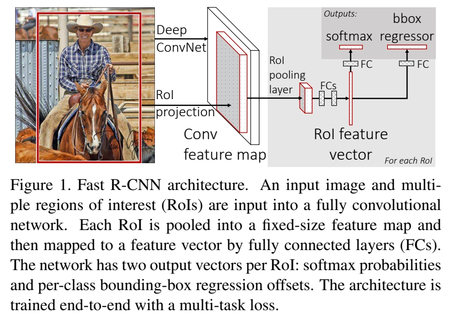

# 文献综述的流程

1. 阅读论文 (我阅读并提问 +AI 辅助回答问题)
2. 根据论文笔记模板填充相关内容。模板如下，借鉴了 [这篇](https://huweim.github.io/post/%E6%80%BB%E7%BB%93_%E8%AE%BA%E6%96%87%E9%98%85%E8%AF%BB%E7%9A%84%E7%AC%94%E8%AE%B0%E6%A8%A1%E6%9D%BF/)，并且补充了个人思考与疑问部分。
3. 最后，将论文与笔记发给 AI，进一步补充完善 (**语言可能会有一些 AI 味**)。

	```markdown
    ## 论文基本信息

    -   **论文标题：**
    -   **作者：**
    -   **发表年份与会议/期刊：**
    -   **核心任务：**

    ## 1. 研究背景与问题重述 (Background & Problem Statement)

    -   **研究背景：**
    -   **核心问题：**

    ## 2. 研究目标与核心贡献 (Research Objectives & Core Contributions)

    -   **研究目标：**
    -   **核心贡献/创新点：**

    ## 3. 方法与工作流程 (Methodology & Workflow)

    -   **核心思想/方法：**
    -   **工作流程（可配图）：**

    ## 4. 实验评估 (Evaluation)

    -   **评估方案：**
    -   **实验设置：**
    -   **主要结果：**
    -   **分析与讨论：**

    ## 5. 结论与展望 (Conclusion & Future Work)

    -   **主要结论：**
    -   **局限性：**
    -   **未来工作：**

    ## 6. 个人思考与疑问 (Personal Thoughts & Questions)

    -   **我的理解与收获：**
    -   **我的疑问：**
    -   **可借鉴之处/批判性思考：**

    ## 7. 总结摘要 (Summary)

    -   (在完成以上所有条目后填写) 用**自己的语言**概括这篇论文的核心思想、主要方法、关键成果和重要性。
    ```

# Rich feature hierarchies for accurate object detection and semantic segmentation

## 论文基本信息

-   **论文标题：** Enhancing Object Detection and Semantic Segmentation with R-CNN: A Scalable Approach Leveraging Convolutional Neural Networks
-   **作者：** Girshick, R., Donahue, J., Darrell, T., & Malik, J.
-   **发表年份与会议/期刊：** CVPR 2014
-   **核心任务：** 目标检测与语义分割

## 1. 研究背景与问题重述 (Background & Problem Statement)

-   **研究背景：** 在这篇论文发表之前，目标检测领域的发展趋于停滞。主流方法如基于 SIFT 和 HOG 特征的系统，虽然在过去十年中推动了视觉识别任务的进步，但在 2010-2012 年间，PASCAL VOC 等标准测试集上的性能提升缓慢。当时的最佳系统通常是复杂的集成系统，这些系统结合了多种低级图像特征以及来自目标检测器和场景分类器的高级上下文信息。
-   **核心问题：** 这篇论文明确指出了先前工作的痛点和局限性：
	-   **性能瓶颈：** 传统目标检测技术（如基于 HOG 的 DPM）的性能已经饱和，提升困难。
	-   **特征限制：** 严重依赖低级、手工设计的特征（如 SIFT, HOG），这些特征可能无法捕捉足够鲁棒和判别性的信息。
	-   **系统复杂性：** 高性能系统往往是多个组件的复杂集成，难以优化和扩展。
	- 作者声称要解决的核心问题是：如何显著提升目标检测的准确性，并提出一种可扩展的方法，同时解决在标记数据稀缺情况下训练高容量模型的问题。

## 2. 研究目标与核心贡献 (Research Objectives & Core Contributions)

-   **研究目标：**
	- 将高容量的卷积神经网络（CNNs）应用于自下而上的区域提议（region proposals），以实现目标定位和分割。
	- 提出一种在标记训练数据稀缺时训练大型 CNN 的范式，即通过在数据充足的辅助任务上进行有监督预训练，然后在数据稀缺的目标任务上进行领域特定的微调。
	- 在 PASCAL VOC 数据集上实现目标检测性能的显著提升。
	- 将该方法扩展到语义分割任务，并取得有竞争力的结果。
-   **核心贡献/创新点：**
	-   **R-CNN (Regions with CNN features) 方法：** 这是最主要的创新点。它将区域提议与强大的 CNN 特征提取器相结合，用于目标检测。
	-   **" 有监督预训练/领域特定微调 " 范式：** 提出并验证了在大规模图像分类数据集（如 ImageNet）上预训练 CNN，然后在目标检测数据集（如 PASCAL VOC）上微调网络的有效性，极大地缓解了在小规模检测数据集上训练深层 CNN 的难题。
	-   **性能突破：** 在 PASCAL VOC 2012 数据集上取得了超过 30% 的相对性能提升，达到了 53.3% 的 mAP，并在 VOC 2010 上达到了 53.7% 的 mAP。
	- 这些贡献针对性地解决了先前的问题：
		-   CNN 的强大特征学习能力取代了手工设计的低级特征，克服了特征限制。
		- 预训练和微调的策略解决了训练数据不足的问题。
		- 尽管 R-CNN 本身是多阶段的，但其核心的特征提取部分由于 CNN 的引入，相比于之前复杂的集成系统，在 " 特征层面 " 实现了一定程度的简化和性能飞跃。

## 3. 方法与工作流程 (Methodology & Workflow)

-   **核心思想/方法：**
	-   R-CNN 的核心机制是两阶段检测：首先生成一系列类别无关的候选区域（region proposals），然后对每个区域使用深度卷积神经网络提取固定长度的特征向量，最后对这些特征使用特定类别的线性 SVM 进行分类。
	- 该方法基于前人的工作：
		-   **区域提议：** 采用了如 Selective Search 等方法生成候选区域。论文中提到其方法对具体的区域提议算法是不可知的（agnostic），但实验中使用了 Selective Search 以便与先前工作进行对照。
		-   **CNN 架构：** 使用了 Krizhevsky 等人提出的 CNN 架构（即 AlexNet），并通过 Caffe 框架实现。
		-   **预训练：** 在大规模 ImageNet 数据集上进行有监督的预训练。
	- 作者在这项研究中依赖的关键假设是：
		- 从大规模图像分类任务中学到的特征对于目标检测任务是可迁移且有益的。
		- 通过将候选区域放缩 (warp) 到固定尺寸，可以有效地利用预训练的 CNN 进行特征提取。
-   **工作流程：**
	- 根据图 1，R-CNN 的完整工作流程如下：
		
		1.  **输入 (Input)：** 一张输入图像。
		2.  **区域提议 (Region Proposals)：** 从输入图像中提取约 2000 个类别无关的候选区域。论文中使用了 Selective Search 方法。
		3.  **特征提取 (Feature Extraction)：**
			- 将每个候选区域（无论原始尺寸或高宽比）通过仿射变换（warp）调整为 CNN 所要求的固定尺寸（例如 227x227 像素，对于 AlexNet）。在放缩前，会对紧密边界框进行扩展（dilate），以包含一定的上下文信息（例如 $p$=16 像素）。图 2 展示了放缩后的训练样本。
			-   
			- 将放缩后的区域输入到一个大型卷积神经网络（如预训练的 AlexNet）中，进行前向传播，提取特征。论文中使用了第 5 个池化层（$\mathrm{pool}_{5}$）、第 6 个全连接层（$\mathrm{fc}_{6}$）或第 7 个全连接层（$\mathrm{fc}_{7}$）的输出作为区域特征（例如一个 4096 维的特征向量）。
		4.  **区域分类 (Region Classification)：** 对每个候选区域提取的特征，使用一组特定类别的线性支持向量机（SVMs）进行分类，判断其属于哪个目标类别或背景。
		5.  **边界框回归 (Bounding Box Regression) (可选但重要)：** 为了进一步提高定位精度，论文中还引入了一个简单的边界框回归阶段，用于修正候选区域的位置（如表 2 中 "R-CNN FT $\mathbf{f}\mathbf{c}_{7}$ BB" 所示）。这一步骤用于减少定位误差。
		6.  **输出 (Output)：** 带有类别标签和精确边界框的目标检测结果。通常会使用非极大值抑制（NMS）来去除冗余的检测框。

	-   **Mermaid 流程图示意：**

		```mermaid
        graph TD
            A[输入图像] --> B(区域提议 Selective Search);
            B --> C{候选区域};
            C --> D(图像放缩 Warp to CNN input size);
            D --> E(CNN特征提取 Krizhevsky et al. CNN);
            E --> F[区域特征向量];
            F --> G(类别相关的线性SVM分类);
            G --> H[分类结果与置信度];
            F --> I(边界框回归 Bounding Box Regression);
            I --> J[修正后的边界框];
            H & J --> K(非极大值抑制 NMS);
            K --> L[最终检测结果];
        ```

## 4. 实验评估 (Evaluation)

-   **评估方案：**
	- 作者主要在 **PASCAL VOC** 数据集上评估他们的方法，包括 VOC 2007 test (表 2)、VOC 2010 (图 1 说明) 和 VOC 2011 test (表 4，用于语义分割)。
	-   
	-   
	- 主要采用了 **平均精度均值 (mean Average Precision, mAP**) 作为目标检测的评估指标。对于语义分割，使用了各类别及平均分割准确率（ 表 4 中的 "mean" 列）。
	-   **图表信息说明：**
		-   **图 1：** 展示了 R-CNN 系统的概览，并指出在 PASCAL VOC 2010 上 mAP 达到 53.7%，显著优于当时使用相同区域提议但采用传统特征的方法（35.1% mAP）以及 DPM（33.4% mAP）。这直接显示了 R-CNN 的优越性。
		-   **表 2：** 展示了在 VOC 2007 test 上不同设置下的检测 AP。关键信息包括：
			- 不同 CNN 层（$\mathrm{pool}_{5}$, $\mathrm{fc}_{6}$, $\mathrm{fc}_{7}$）作为特征时的性能对比。
			- 有无在 VOC 上进行微调（FT）的性能对比，证明了微调的显著效果（例如，$\mathrm{fc}_{7}$ 从 44.7% mAP 提升到 FT $\mathrm{fc}_{7}$ 的 54.2% mAP）。
			- 加入边界框回归（BB）后性能进一步提升（从 54.2% mAP 提升到 58.5% mAP），说明了其对定位误差的修正作用。
			- 与 DPMv5 (33.7% mAP) 等基线模型相比，R-CNN FT $\mathbf{f}\mathbf{c}_{7}$ BB (58.5% mAP) 取得了巨大优势。
		-   **表 4：** 展示了在 VOC 2011 test 上的语义分割结果。R-CNN（ours，这里是 ffull+fgR-CNN $\mathrm{fc}_{6}$）在不进行微调的情况下，达到了 47.9% 的平均准确率，优于 R&P (40.8%) 并与 O2P (47.6%) 相当。
-   **实验设置：**
	-   **预训练：** CNN 在 ILSVRC2012 分类数据集上进行有监督预训练。
	-   **微调：** 在 PASCAL VOC 的训练集上（例如 VOC 2007 trainval）进行领域特定的微调。微调时，将 CNN 的 ImageNet 特有的 1000 类分类层替换为一个随机初始化的 21 类（20 个 VOC 类别 + 背景）分类层。IoU 大于等于 0.5 的区域提议被视为对应类别的正样本。使用随机梯度下降（SGD）进行训练。
	-   **特征提取：** 使用 Krizhevsky 等人的 CNN 架构（通过 Caffe 实现），输入为 227x227 像素的放缩后图像区域。
	-   **区域提议：** 使用 Selective Search 生成约 2000 个区域。
	-   **分类器：** 对每个类别训练一个线性的 SVM。
-   **主要结果：**
	- 在 PASCAL VOC 2010 上，R-CNN 实现了 53.7% 的 mAP，显著高于使用相同区域提议但基于空间金字塔和视觉词袋方法的 35.1% mAP，以及流行的 DPM 的 33.4% (图 1 描述)。
	- 在 PASCAL VOC 2007 测试集上，经过微调并使用 $\mathrm{fc}\tiny{7}$ 层特征以及边界框回归的 R-CNN (R-CNN FT $\mathbf{f}\mathbf{c}\tiny{7}$ BB) 达到了 58.5% 的 mAP，远超 DPMv5 的 33.7% (表 2)。
	- 结果强调了微调的重要性：例如，在 VOC 2007 上，仅使用预训练的 CNN，$\mathrm{fc}_{7}$ 层特征的 mAP 为 44.7%；经过微调后，$\mathrm{fc}_{7}$ 层特征的 mAP 提升至 54.2% (表 2)。
	- 这些结果有力地证明了 R-CNN 方法（尤其是结合预训练和微调的 CNN 特征）在目标检测任务上的有效性和巨大潜力。
-   **分析与讨论：**
	- 作者分析了不同 CNN 层对性能的影响，发现全连接层（尤其是 $\mathrm{fc}\tiny{6}$ 和 $\mathrm{fc}\tiny{7}$ 在微调后）通常能提供更好的性能（表 2）。
	- 论文指出 CNN 学习到的特征（如卷积层特征，如图 3 所示）是丰富且多样化的。一项 " 脑白质切除术 "（lobotomized a CNN）实验表明，即使移除 CNN 中 94% 的参数，检测精度的下降也只是适度的，这暗示卷积层学习到的特征至关重要。
	-   
	- 通过使用 Hoiem 等人的检测分析工具，作者识别出定位不准是主要的错误模式，并通过引入简单的边界框回归方法显著减少了这类错误。
	-   R-CNN 系统的一个优势是其计算效率（相对于某些先前方法），因为类别相关的计算仅限于一个较小的矩阵向量乘积（SVMs）和非极大值抑制，特征在所有类别间共享，并且特征维度比之前使用的区域特征低两个数量级。

## 5. 结论与展望 (Conclusion & Future Work)

-   **主要结论：**
	-   **Strong conclusions:**
		- 将高容量 CNN 应用于区域提议进行特征提取，能够显著提升目标检测的性能。
		-   " 有监督预训练（在大规模分类数据集上）+ 领域特定微调（在目标检测数据集上）" 的范式对于解决目标检测任务（尤其是在标记数据相对稀缺时）非常有效。
		-   CNN 学习到的特征远优于传统的 SIFT、HOG 等手工设计特征。
	-   **Weaker conclusions / Discussions:**
		-   R-CNN 的方法可以自然地扩展到语义分割任务，并取得 SOTA 或有竞争力的结果。
		-   " 有监督预训练/领域特定微调 " 范式可能对各种数据稀缺的视觉问题都非常有效（作者的推测）。
-   **局限性：**
	-   **文中直接提及的：** 在引入边界框回归之前，定位不准确（mislocalizations）是主要的错误模式。
	-   **根据我的理解，该方法存在的潜在局限性（部分未在摘要和片段中明确说明，但基于对 R-CNN 的普遍认知）：**
		-   **训练和推理速度较慢：** R-CNN 是一个多阶段的流程（区域提议、对每个区域提议进行 CNN 前向传播、SVM 分类、边界框回归）。特别是对数千个区域提议独立进行 CNN 特征提取，计算成本很高。
		-   **训练过程复杂：** 需要分别训练 CNN（预训练 + 微调）、SVM 分类器和边界框回归器，不是一个端到端的系统。
		-   **空间浪费：** 存储所有候选区域的特征需要大量磁盘空间。
-   **未来工作：**
	-   **文中提及或暗示的：**
		- 进一步研究和减少检测错误，例如通过改进定位。
		- 将 " 有监督预训练/领域特定微调 " 范式推广到更多数据稀缺的视觉识别问题。
		- 进一步探索 CNN 学习到的特征。
	-   **基于我的理解，值得进一步拓展的方向：**
		- 提高检测速度和效率，例如通过共享计算（后续的 Fast R-CNN, Faster R-CNN 等工作）。
		- 实现端到端的训练和检测。
		- 改进区域提议机制，使其更高效或与后续网络集成。

## 6. 个人思考与疑问 (Personal Thoughts & Questions)

-   **我的理解与收获：**
	- 我对这篇论文的核心思想的理解是，它成功地将深度学习的强大特征表示能力引入到目标检测领域，通过 " 区域提议 +CNN 特征提取 + 分类 " 的框架，显著超越了传统方法。关键在于认识到 ImageNet 预训练的 CNN 模型所学到的特征具有良好的泛化性，可以通过微调适应到检测任务。
	- 它对其具体研究领域（目标检测）的发展具有里程碑式的意义，开启了深度学习在目标检测领域应用的新时代，并为后续的 Fast R-CNN, Faster R-CNN, Mask R-CNN 等一系列更优方法奠定了基础。
	- 它与我已学的深度学习知识紧密相关：
		-   **卷积层与池化层：** 用于从图像区域中学习和提取层次化的视觉特征。
		-   **全连接层：** 用于在提取的特征基础上进行高层抽象和分类准备。
		-   **Softmax/分类器：** CNN 微调时最后一层通常是分类器（论文中替换为 21 路）；之后还用了 SVM 进行最终分类。
		-   **迁移学习：** " 预训练 + 微调 " 是迁移学习的典型应用，将在大规模数据集上学到的知识迁移到数据量较小的特定任务上。
		-   **数据增强/预处理：** 候选区域的放缩（warping）和上下文扩展是重要的数据处理步骤。
-   **我的疑问：**
	- 文中提到 "lobotomized"CNN 实验移除了 94% 的参数，检测精度仅有适度下降。我想了解这个实验的具体细节，例如哪些参数被移除，以及 " 适度下降 " 的具体数值。
	- 虽然论文提到对区域提议方法是不可知的，但区域提议的质量和数量对最终性能和速度的影响有多大，是否进行了相关分析？
	- 文中提到其 CNN 在 ILSVRC2012 上的 top-1 错误率比 Krizhevsky 等人的结果高 2.2 个百分点，原因是 " 训练过程中的简化 "。这些简化具体指什么？
-   **可借鉴之处/批判性思考：**
	-   **值得借鉴：**
		- 大胆地将不同领域（图像分类）的成功模型和方法（CNN、预训练）应用于新问题（目标检测）。
		- 系统性的实验设计，如逐层分析（performance layer-by-layer）、错误分析（diagnosing error）并据此提出改进（bounding box regression）。
		-   " 预训练 + 微调 " 的策略在处理数据量不足的特定任务时非常有效，这一点在我的其他研究中也可能适用。
	-   **可以改进或进一步探讨的点：**
		- 如前述局限性所言，其多阶段、计算密集型的流程是明显的改进方向。
		-   SVM 分类器的使用相较于直接用 CNN 的 softmax 输出进行分类，增加了训练复杂性，后续工作证明了端到端训练的可行性和优势。
		- 固定尺寸的区域放缩（warping）可能会导致物体形变，影响特征质量，后续的 SPP-Net 等工作对此进行了改进。
	-   **潜在应用：**
		- 除了目标检测和语义分割，这种 " 提议 + 验证 " 的思想以及强大的 CNN 特征，可以被用于更细粒度的识别任务（如特定商品识别）、视频中的目标跟踪（通过逐帧检测或更高效的方式）、以及任何需要从图像中定位并识别特定对象的场景。

## 7. 总结摘要 (Summary)

- 我从这篇 R-CNN 论文中凝练的核心思想是，它通过一个创新的两阶段方法（区域提议后接 CNN 特征提取与分类）成功地将深度卷积神经网络应用于目标检测。其主要方法包括使用如 Selective Search 生成候选区域，将这些区域放缩后输入预训练（在 ImageNet 上）并微调（在 PASCAL VOC 上）的 CNN（如 AlexNet）以提取高级特征，然后用 SVM 进行分类并辅以边界框回归来精确定位。关键成果是在 PASCAL VOC 等基准数据集上实现了目标检测准确率的巨大突破（例如，在 VOC 2007 test 上达到 58.5% mAP，远超此前的 DPM 等方法），并展示了 CNN 特征的强大威力以及 " 预训练 + 微调 " 范式的有效性。这项工作的重要性在于它为后续基于深度学习的目标检测研究奠定了坚实基础，开创了一个新时代。

# Spatial Pyramid Pooling in Deep Convolutional Networks for Visual Recognition

## 论文基本信息

-   **论文标题：** Spatial Pyramid Pooling in Deep Convolutional Networks for Visual Recognition
-   **作者：** Kaiming He, Xiangyu Zhang, Shaoqing Ren, Jian Sun
-   **发表年份与会议/期刊：** ECCV 2014
-   **核心任务：** 图像分类, 目标检测

## 1. 研究背景与问题重述 (Background & Problem Statement)

-   **研究背景：**
	当时，深度卷积神经网络 (CNNs) 在图像识别任务上取得了显著成功。然而，主流的 CNN 架构（如 AlexNet, VGG 等）通常要求固定尺寸的输入图像（例如 224x224）。为了处理不同尺寸的输入图像，通常采用的方法是对原始图像进行裁剪 (cropping) 或缩放/变形 (warping)。
-   **核心问题：**
	这篇论文明确指出了先前工作存在的痛点：
	1.  **固定输入尺寸限制：** 传统 CNN 要求固定输入图像尺寸，这导致对任意尺寸图像进行处理时，不得不进行裁剪或缩放。裁剪可能导致信息丢失（尤其当目标物体部分被裁掉时），而缩放则可能引入不期望的几何形变，都可能影响识别精度。
	2.  **重复计算：** 在目标检测任务中，如 R-CNN，需要对每个候选区域独立地通过 CNN 提取特征，这导致了大量的冗余计算，因为许多候选区域会有重叠。
	作者声称要解决的核心问题是：如何使 CNN 能够处理任意尺寸的输入图像，同时生成固定长度的特征表示，以适应后续的全连接层或分类器，并提高目标检测的效率。

## 2. 研究目标与核心贡献 (Research Objectives & Core Contributions)

-   **研究目标：**
	1.  提出一种新的网络结构，使其能够接受任意尺寸的输入图像。
	2.  生成一个固定长度的输出表示，无论输入尺寸如何变化。
	3.  提高基于区域提议的目标检测方法（如 R-CNN）的训练和测试速度。
	4.  在保持甚至提升识别精度的前提下实现上述目标。
-   **核心贡献/创新点：**
	1.  **引入空间金字塔池化层 (Spatial Pyramid Pooling, SPP layer)：** 这是论文最核心的创新。SPP 层被放置在最后一个卷积层之后（例如 `conv5`），它对卷积特征图进行多尺度、多区域的池化，然后将池化后的特征拼接起来，形成一个固定长度的特征向量。
	2.  **解决固定输入尺寸问题：** SPP 层使得网络可以处理任意尺寸的输入。无论输入特征图的尺寸如何，SPP 层通过调整池化核的大小和步长，总能划分出固定数量的池化区域（bins），从而得到固定维度的输出。这避免了输入图像的裁剪或缩放操作，保留了完整的图像信息。
	3.  **显著提升目标检测效率：** 对于目标检测，SPP-net 允许只对整个输入图像进行一次卷积特征提取。然后，对于每个候选区域，可以直接将其映射到整个图像的特征图上，并使用 SPP 层从该区域提取固定长度的特征，而无需对每个区域单独进行卷积计算。这大大减少了计算量。
	4.  **提高分类精度：** 通过处理多尺度信息和避免信息损失，SPP-net 在图像分类任务上也取得了性能提升。
	这些贡献的独特性在于，SPP 层巧妙地将传统的空间金字塔匹配思想（常用于 BoW 模型）引入到深度学习框架中，解决了 CNN 对输入尺寸的依赖性，并为目标检测带来了显著的效率提升。

## 3. 方法与工作流程 (Methodology & Workflow)

-   **核心思想/方法：**
	-   
	- 核心机制是在最后一个卷积层（如 `conv5`）之后、全连接层之前插入一个 SPP 层。
	-   SPP 层使用多个不同尺度的池化网格。例如，一个三层金字塔可能包含 4x4、2x2 和 1x1 的网格。对于 `conv5` 输出的特征图（假设有 `k` 个通道），4x4 的网格会产生 `16*k` 维特征，2x2 的网格产生 `4*k` 维特征，1x1 的网格产生 `k` 维特征。这些特征被连接起来形成一个固定长度的向量（在这个例子中是 `(16+4+1)*k` 维）。
	- 池化操作通常是最大池化 (max pooling)。每个池化网格的单元（bin）的尺寸和步长是根据输入特征图的尺寸动态计算的，以确保输出固定数量的 bins。
	- 该方法继承了空间金字塔匹配 (Spatial Pyramid Matching, SPM) 的思想，但将其应用于深度卷积特征图，而不是传统的 SIFT 等局部特征。
	- 关键假设是：从不同空间粒度（金字塔层级）池化得到的卷积特征能够有效地捕获图像或区域的判别性信息，并且这些特征拼接后能形成一个鲁棒的固定长度表示。
-   **工作流程：**
	
	1.  **输入图像 (Input Image)：** 任意尺寸的图像输入到网络中。
	2.  **卷积层 (Convolutional Layers)：** 图像经过一系列卷积层（例如一直到 `conv5` 层）处理，提取出特征图 (feature maps)。这些特征图的尺寸会随着输入图像尺寸的变化而变化，但通道数是固定的（例如，图中 `conv5` 输出 256 通道的特征图，表示为 256-d）。
	3.  **空间金字塔池化层 (Spatial Pyramid Pooling Layer)：**
		-   `conv5` 的输出特征图（任意尺寸）被送入 SPP 层。
		-   SPP 层包含多个预设的金字塔层级。图中展示了三个层级：
			-   **层级 1 (最细粒度):** 将特征图划分为一个较密的网格，例如一个隐式的 4x4 网格（图中用 16 个蓝色小方块代表其输出的 16 个区域的池化结果）。对每个网格区域内的特征进行池化（如最大池化）。如果 `conv5` 有 256 个通道，则这一层级会产生 $16 \times 256-d$ 的特征。（图中标识为 `16x256-d`）
			-   **层级 2 (中等粒度):** 将特征图划分为一个较稀疏的网格，例如一个隐式的 2x2 网格（图中用 4 个绿色小方块代表其输出的 4 个区域的池化结果）。同样对每个区域进行池化，产生 $4 \times 256-d$ 的特征。（图中标识为 `4x256-d`）
			-   **层级 3 (最粗粒度):** 将整个特征图作为一个区域进行池化（隐式的 1x1 网格，图中用 1 个灰色小方块代表其输出）。产生 $1 \times 256-d$ (即 256-d) 的特征。（图中标识为 `256-d`）
		- 这三个层级的池化是并行的。
	4.  **固定长度表示 (Fixed-length Representation)：**
		- 将来自 SPP 层所有层级的池化特征向量拼接 (concatenate) 起来。在图示的例子中，输出维度是 $(16 \times 256) + (4 \times 256) + (1 \times 256)$。
		- 这个拼接后的向量具有固定的长度，与输入 `conv5` 特征图的原始尺寸无关。
	5.  **全连接层 (Fully-connected Layers)：**
		- 固定的长度表示随后被送入标准的全连接层（例如 `fc6`, `fc7`）。
	6.  **输出 (Output)：** 全连接层之后是最终的输出，例如分类任务的 Softmax 层或目标检测的类别得分和边界框回归。

	用 Mermaid 语法绘制一个简化的流程，可以表示为：

	```mermaid
    graph TD
        A[输入图像（任意尺寸）] --> B(卷积层 conv1-conv5);
        B --> C{特征图 of conv5（任意尺寸, 256通道）};
        C --> D1[SPP层: 4x4网格池化];
        C --> D2[SPP层: 2x2网格池化];
        C --> D3[SPP层: 1x1网格池化];
        D1 --> E1(16 x 256-d 特征);
        D2 --> E2(4 x 256-d 特征);
        D3 --> E3(1 x 256-d 特征);
        E1 --> F[拼接];
        E2 --> F;
        E3 --> F;
        F --> G(固定长度表示);
        G --> H(全连接层 fc6, fc7);
        H --> I[输出（分类/检测等）];
    ```

## 4. 实验评估 (Evaluation)

-   **评估方案：**
	-   **数据集：**
		- 图像分类：ImageNet 2012, Caltech101
		- 目标检测：Pascal VOC 2007, ILSVRC 2014 detection
	-   **评估指标：**
		- 图像分类：top-1 error, top-5 error
		- 目标检测：mean Average Precision (mAP)
	-   **关键图表：**
		-   Table 4 (ImageNet 2012 分类结果)：展示了 SPP-net 在不同配置下（如 SPP O-7）相比其他方法（Krizhevsky et al., Overfeat 等）的错误率，显著降低了 top-1 和 top-5 错误率。例如，SPP O-7 使用 10 个视图在 ImageNet 2012 验证集上取得了 29.68% 的 top-1 错误率和 10.95% 的 top-5 错误率。
		-   
		-   Table 8 (Caltech101 分类结果)：SPP-net 在 Caltech101 上取得了 93.42% 的准确率，显著优于当时的其他方法。
		-   
		- 论文中还应有关于目标检测速度提升的比较，例如 SPP-net 相比 R-CNN 在 PASCAL VOC 上的速度提升几十~一百倍。
		-   
-   **实验设置：**
	-   **训练细节：**
		-   **多尺寸训练 (Multi-size training):** 为了模拟不同输入尺寸，作者提出了一种多尺寸训练策略。例如，在一个 epoch 中使用 224x224 的图像训练，在下一个 epoch 中使用 180x180 的图像训练，或者在每个 epoch 中从一个尺寸范围（如 [180, 224]）随机采样。
		-   Fine-tuning：对于在 ImageNet 上预训练的模型，在目标任务（如 VOC 检测）上进行 fine-tuning 时，通常只 fine-tune 全连接层。
		-   SVM 训练：对于目标检测，提取 SPP 特征后，使用 SVM 进行分类。
	-   **测试细节：**
		- 在测试阶段，SPP-net 可以直接处理任意尺寸的图像。
		-   Multi-view testing on feature maps：对于分类任务，可以从整张图像的特征图上提取多个不同位置和尺寸的窗口（views），使用 SPP 池化得到特征，然后平均分数。
-   **主要结果：**
	-   **图像分类（ImageNet 2012）：** SPP-net 显著优于没有 SPP 的类似架构。例如，SPP O-7 (Overfeat-7
		基础) 的 top-5 错误率比 Overfeat (big) (14.18%) 更低 (如 10.95% 或 9.14%) (Table 4)。
	-   **目标检测（PASCAL VOC 2007）：** SPP-net 相比 R-CNN，在特征提取阶段有 24-102 倍的速度提升，同时 mAP 也有所提高。这是因为 SPP-net 对整张图只计算一次卷积特征。
	-   **目标检测（ILSVRC 2014）：** SPP-net 取得了该竞赛目标检测任务的第二名。
	-   **Caltech101 分类：** SPP-net (93.42%) 比先前的最佳方法 Chatfield et al. (88.54%) 提升了 4.88% (Table 8)。
	- 这些结果有力地证明了 SPP 层在处理任意尺寸输入、提升效率和精度方面的有效性。
-   **分析与讨论：**
	-   **优势：**
		-   SPP 层对网络架构具有普适性，可以提升多种不同 CNN 架构的性能 (如 ZF-5, Overfeat-5/7 等，见 Table 1)。
		-   
		- 多尺寸训练可以进一步提高模型的鲁棒性和准确性。
		- 避免了裁剪和缩放带来的信息损失或形变，尤其对于物体尺度变化较大的场景更有利。
	-   **潜在不足（或当时未完全解决的）：**
		- 虽然 SPP 层本身可以处理任意尺寸，但训练过程（尤其是多尺寸训练）可能比单尺寸训练略复杂。
		-   SPP 层的金字塔层级和每层的 bin 数量是预先设定的超参数。
		- 目标检测流程中，候选区域的生成仍然依赖于外部算法（如 Selective Search），并且 SVM 训练和边界框回归仍然是分阶段的，不是完全的端到端训练。

## 5. 结论与展望 (Conclusion & Future Work)

-   **主要结论：**
	-   **Strong conclusions:**
		-   SPP 层能够有效地使 CNN 接受任意尺寸的输入图像，并产生固定长度的特征表示。
		-   SPP-net 在图像分类任务上能够提高准确率，特别是在处理不同尺度图像和采用多视图测试时。
		-   SPP-net 能够显著加速基于区域提议的目标检测方法，因为它避免了对每个候选区域的重复卷积计算。
	-   **Weaker conclusions / Discussions:**
		- 多尺寸训练是一种有效的策略，能够模拟可变输入尺寸并提升性能。
		-   SPP-net 在各种不同深度的 CNN 架构上都表现出良好的泛化能力和提升效果。
-   **局限性：**
	- 作者在论文中可能没有明确强调太多局限性，但在当时背景下：
		-   SPP 层的配置（金字塔层数、每层 bin 数）依赖经验设定。
		- 目标检测流程仍然不是端到端的，依赖于外部区域提议和后续的 SVM 分类/回归。
		- 虽然解决了卷积部分的任意尺寸输入，但训练和优化整个网络的复杂性可能有所增加。
-   **未来工作：**
	- 作者可能展望了将 SPP 思想进一步集成到更深、更复杂的网络中。
	- 探索端到端的目标检测系统（后续 Fast R-CNN, Faster R-CNN 等工作确实沿着这个方向发展，并借鉴了 SPP 的思想，演化出 RoI Pooling）。
	- 将 SPP 应用于其他视觉任务，如语义分割等。
	- 我推测，进一步研究如何动态地或可学习地确定 SPP 的结构可能是未来的一个方向。

## 6. 个人思考与疑问 (Personal Thoughts & Questions)

-   **我的理解与收获：**
	- 我对这篇论文核心思想的理解是，SPP 层通过在卷积特征图上进行多尺度空间池化，巧妙地解耦了网络卷积部分和全连接部分对输入尺寸的依赖，使得网络更加灵活和高效。
	- 它对目标检测领域的发展具有里程碑意义，极大地推动了后续高效检测框架（如 Fast R-CNN 中的 RoI Pooling 层可以看作是 SPP 的一个简化特例）的出现。
	- 它与我已学的卷积（特征提取）、池化（降维、增加感受野、引入少量不变性）紧密相关。SPP 是一种更高级、更灵活的池化策略。
-   **我的疑问：**
	-   SPP 层中不同金字塔层级的特征是如何加权的？论文中是简单拼接，那么不同层级的贡献是否均等？
	- 在目标检测中，将候选区域投影到整图的特征图上时，如果候选区域非常小，对应的特征图区域也非常小，SPP 层（尤其是多 bin 的层级）如何有效池化？是否会有很多 bin 覆盖相同的或极少的特征图单元？
	- 多尺寸训练策略的具体实现细节，例如学习率如何调整以适应不同尺寸带来的 batch 内统计特性的变化？
-   **可借鉴之处/批判性思考：**
	-   SPP 解决固定输入尺寸限制的思想非常巧妙，这种 " 在中间层加入适配模块 " 的思路值得借鉴。
	- 实验设计充分，对比了多种基线模型和数据集，验证了方法的普适性和有效性。
	- 可以思考 SPP 层是否可以设计成可学习的，例如通过注意力机制来动态决定不同池化区域的权重或池化策略。
	- 与我之前记录的 R-CNN 笔记相比，SPP-net 直接解决了 R-CNN 最主要的计算瓶颈。它也是 Fast R-CNN 中 RoI Pooling 思想的直接前身和启发。
	-   SPP 思想除了用于分类和检测，还可以潜力应用于其他需要处理可变尺寸输入的视觉任务，例如图像检索中对不同区域提取特征，或者在视频分析中处理不同长度的片段序列（时间上的 SPP）。

## 7. 总结摘要 (Summary)

- 这篇论文的核心思想是引入了一个**空间金字塔池化 (SPP) 层**到深度卷积神经网络中。该 SPP 层被置于最后一个卷积层和全连接层之间，通过在多个固定的空间网格尺度上对卷积特征图进行池化（如最大池化），并将这些多尺度池化后的特征拼接起来，从而产生一个**固定长度的特征表示**，无论输入图像或特征图的原始尺寸如何。
- 主要方法在于这个 SPP 层的设计，它使得 CNN 能够**处理任意尺寸的输入图像**，克服了传统 CNN 对固定输入尺寸的限制，避免了因此导致的信息损失（裁剪）或几何形变（缩放）。
- 关键成果包括：1) 显著提升了图像分类的准确率（如在 ImageNet 和 Caltech101 上的表现）；2) 极大地加速了基于区域提议的目标检测方法（如 R-CNN），因为它允许对整张图像只计算一次卷积特征，然后对各候选区域在特征图上使用 SPP 提取特征。
- 这项工作的重要性在于它为 CNN 带来了前所未有的输入灵活性，并为后续更高效的目标检测框架（如 Fast R-CNN 的 RoI Pooling）奠定了坚实的基础，是深度学习视觉领域的一个重要进展。

# Fast R - CNN

## 论文基本信息

-   **论文标题：** Fast R-CNN
-   **作者：** Ross Girshick
-   **发表年份与会议/期刊：** ICCV 2015
-   **核心任务：** 目标检测

## 1. 研究背景与问题重述 (Background & Problem Statement)

-   **研究背景：** 当时，基于区域的卷积神经网络（R-CNN）及其变体（如 SPPnet）是主流的目标检测方法。R-CNN 首先使用选择性搜索等算法提取约 2000 个候选区域（Region Proposals），然后将每个区域缩放到固定大小并独立送入 CNN 提取特征，最后用 SVM 进行分类并用回归器优化边界框。SPPnet 通过在卷积特征图上使用空间金字塔池化，实现了对整张图只进行一次卷积计算，提高了速度，但训练依然是多阶段的，且无法更新 SPP 层之前的卷积层。
-   **核心问题：** 这篇论文明确指出了先前工作的痛点：
	1.  **训练是多阶段流程：** R-CNN 需要先用 log 损失微调网络，然后为每个类别训练线性 SVM，最后再训练边界框回归器。SPPnet 也存在类似的多阶段训练问题。这种流程复杂且耗时。
	2.  **训练耗费空间和时间：** R-CNN 和 SPPnet 在训练时需要将从每个候选区域提取的特征写入磁盘，用于训练 SVM 和回归器，这既耗时又占用大量存储空间。
	3.  **目标检测速度慢：** R-CNN 对每个候选区域独立进行 CNN 前向传播，计算量巨大。SPPnet 虽有改进，但相比 Fast R-CNN 仍有较大差距。
	作者声称要解决的核心问题是开发一个更快速、更简洁、准确率更高的目标检测框架，实现端到端的单阶段训练。

## 2. 研究目标与核心贡献 (Research Objectives & Core Contributions)

-   **研究目标：**
	1.  实现比 R-CNN 和 SPPnet 更高的检测准确率（mAP）。
	2.  实现单阶段训练，使用一个多任务损失函数同时学习分类和边界框回归。
	3.  在训练过程中能够更新所有网络层，包括 SPP 层之前的卷积层。
	4.  消除对磁盘特征缓存的需求，提高训练和测试效率。
-   **核心贡献/创新点：**
	1.  **RoI (Region of Interest) 池化层：** 这是最主要的创新。RoI 池化层是一个特殊的空间金字塔池化层，它只有一个金字塔层级。它能够将任意大小的候选区域对应的卷积特征图区域转换为固定大小的特征向量，这些特征向量随后被送入全连接层。这使得网络可以处理不同尺寸的输入 RoI，并且允许在训练期间反向传播通过该层，从而可以端到端地训练整个网络（包括卷积层）。
	2.  **单阶段训练算法：** Fast R-CNN 通过引入多任务损失函数，将类别分类和边界框回归统一在一个框架下进行联合优化。这简化了 R-CNN 和 SPPnet 复杂的多阶段训练流程，提高了训练效率。
	3.  **所有网络层的参数更新：** 与 SPPnet 不同（SPPnet 通常固定卷积层参数，只训练全连接层），Fast R-CNN 能够在训练过程中更新所有网络层（从输入层到最后的分类/回归层）的权重，这有助于获得更好的性能。
	4.  **无需磁盘存储特征：** 由于训练是端到端的，并且特征在网络内部流动，因此不需要像 R-CNN 那样将特征缓存到磁盘上，节省了大量存储空间和 I/O 时间。

	这些贡献针对性地解决了先前工作的痛点：

	-   RoI 池化层和单阶段训练简化了训练流程，解决了多阶段训练的复杂性。
	- 通过共享卷积计算和 RoI 池化，以及消除了特征缓存，极大地提升了训练和测试速度，并减少了空间占用。
	- 能够更新所有网络层，使得模型有潜力学习到更优的特征表示，从而提升准确率。

## 3. 方法与工作流程 (Methodology & Workflow)

-   **核心思想/方法：**
	-   Fast R-CNN 的核心思想是共享卷积计算。整个输入图像首先通过一系列卷积层和最大池化层（例如 VGG16 的前几层）来产生一个卷积特征图。然后，对于每个候选区域（RoI），使用新提出的 RoI 池化层从该共享的卷积特征图中提取一个固定长度的特征向量。这些特征向量随后被送入一系列全连接（FC）层，最终分支出两个同级输出层：一个用于 K 个对象类别加 1 个 " 背景 " 类别的 softmax 分类器，另一个是为每个对象类别预测边界框精确位置的回归器。
	- 该方法继承了 R-CNN 使用候选区域的思想和 SPPnet 共享卷积计算的思想。RoI 池化层可以看作是 SPPnet 中空间金字塔池化层的一个简化版（单尺度）。
	- 关键假设是，由外部算法（如 Selective Search）生成的候选区域能够以较高的召回率覆盖图像中的大部分真实对象。
-   **工作流程：**
	
	1.  **输入 (Input)：** 接收一张完整图像和一组由外部算法（如 Selective Search）生成的候选区域 (Regions of Interest - RoIs)。
	2.  **深度卷积网络 (Deep ConvNet)：** 整个图像被送入一个深度卷积网络（例如 VGG16）。这个网络由若干卷积层和池化层组成，用于提取图像的深层特征。这一步产生一个全局的卷积特征图 (Conv feature map)。
	3.  **候选区域投影 (RoI projection)：** 将原始图像上的每个 RoI 的坐标投影到步骤 2 生成的卷积特征图上，以确定每个 RoI 在特征图上对应的区域。
	4.  **RoI 池化层 (RoI pooling layer)：** 对于每个投影到特征图上的 RoI 区域（这些区域大小不一），RoI 池化层将其转换为一个固定大小的特征图（例如 7x7）。这是通过将 RoI 区域划分为 H x W 个子窗口，并在每个子窗口内执行最大池化来实现的。这样，无论原始 RoI 的大小如何，输出都是一个固定维度的特征向量。
	5.  **全连接层 (FCs)：** 从 RoI 池化层输出的固定大小的特征向量（Rol feature vector）被展平并通过一系列全连接层（FCs）进行进一步的非线性变换和特征融合。
	6.  **输出层 (Outputs)：** 经过全连接层后，特征向量被送入两个并行的输出层：
		-   **Softmax 分类器 (softmax)：** 对每个 RoI 进行分类，输出其属于 K 个对象类别以及 1 个背景类别的概率。
		-   **边界框回归器 (bbox regressor)：** 对每个被识别为对象的 RoI，输出 4 个值，用于微调原始 RoI 的边界框位置，使其更接近真实对象的边界框。
	7.  **针对每个 RoI (For each RoI)：** 上述步骤 4-6 对每个候选区域都独立执行（但共享底层的卷积网络和全连接层参数）。在训练时，使用一个多任务损失函数，该损失函数是分类损失（如交叉熵损失）和边界框回归损失（如 Smooth L1 损失）的加权和。

	基于上述步骤，可以绘制一个简化的 Mermaid 流程图：

	```mermaid
    graph TD
        A[输入: 图像 + RoIs] --> B{Deep ConvNet};
        B --> C[卷积特征图];
        A -- RoI坐标 --> D[RoI 投影];
        C & D --> E{RoI 池化层};
        E --> F[固定大小 RoI 特征向量];
        F --> G[全连接层（FCs）];
        G --> H[Softmax 分类器];
        G --> I[Bbox 回归器];
        H --> J[类别概率];
        I --> K[边界框调整值];
    ```

## 4. 实验评估 (Evaluation)

-   **评估方案：**
	-   **数据集：** 主要使用了 PASCAL VOC 2007、PASCAL VOC 2010 和 PASCAL VOC 2012 数据集进行评估。论文中也提及了在 MS COCO 数据集上的初步结果。
	-   **评估指标：** 主要使用平均精度均值 (mean Average Precision, mAP) 作为目标检测性能的评估指标。此外，还比较了训练时间（小时）和测试速率（秒/图像，s/im）。
	-   **关键图表：**
		-   Table 1, 2, 3 展示了在 VOC07, VOC10, VOC12 测试集上与其他方法的 mAP 对比。例如，在 VOC07 上，Fast R-CNN (FRCN) 使用 VGG16 (模型 L) 取得了 66.9% 的 mAP，优于 R-CNN 的 66.0% 和 SPPnet 的 63.1% (来自 Table 4 的数值便于直接对比)。
		-   
		-   Table 4 非常关键，它对比了 Fast R-CNN, R-CNN, SPPnet 在训练时间、测试速率和 mAP 上的表现。例如，对于 VGG16 (L) 模型，Fast R-CNN 训练时间为 9.5 小时，远少于 R-CNN 的 84 小时和 SPPnet 的 25 小时（应为 25.5 小时）；测试速率为 0.32 秒/图，远快于 R-CNN 的 47.0 秒/图和 SPPnet 的 2.3 秒/图。
		-   
		-   Table 5 展示了微调不同卷积层对性能的影响，证明了微调从 conv3_1 开始的层可以带来显著 mAP 提升（从 61.4% 到 66.9%）。
		-   
		-   Table 6 表明多任务训练（同时优化分类和回归）比分阶段训练能带来更好的 mAP。
		-   
-   **实验设置：**
	-   **网络模型：** 使用了三种预训练的 ImageNet 模型：CaffeNet (S - small), VGG_CNN_M_1024 (M - medium), 和 VGG16 (L - large)。
	-   **训练细节：**
		- 优化器：SGD
		- 学习率：全局学习率为 0.001，在 VOC07 或 VOC12 trainval 上训练 30k 次迭代后降至 0.0001 再训练 10k 次。偏置的学习率是权重的 2 倍。
		- 批大小 (Mini-batch)：每个 SGD mini-batch 包含 N=2 张图像，每张图像采样 R=128 个 RoI 中的 R/N=64 个。RoIs 中约 25% 为前景（与真实边界框 IoU >= 0.5），其余为背景（IoU 在 [0.1, 0.5) 之间）。
		- 动量 (Momentum)：0.9
		- 权重衰减 (Parameter decay)：0.0005
		- 初始化：用于 softmax 分类和边界框回归的全连接层权重从均值为 0、标准差分别为 0.01 和 0.001 的高斯分布中初始化，偏置初始化为 0。
	-   **测试细节：** 论文中提到实验使用单尺度训练和测试（s=600 像素的最短边）。
-   **主要结果：**
	-   **速度提升：** Fast R-CNN (VGG16) 训练速度比 R-CNN 快约 9 倍，比 SPPnet 快约 3 倍。测试速度（不含候选区域提取）比 R-CNN 快 213 倍，比 SPPnet 快 10 倍。
	-   **准确率提升：** 在 PASCAL VOC 2007, 2010, 2012 数据集上，Fast R-CNN 均取得了优于 R-CNN 和 SPPnet 的 mAP。例如，在 VOC07 上，VGG16 的 Fast R-CNN 达到 66.9% mAP，而 R-CNN 为 66.0%，SPPnet 为 63.1%。
	-   **端到端训练的有效性：** 实验证明，微调卷积层（如从 VGG16 的 conv3_1 开始）可以显著提高 mAP (Table 5)，表明端到端训练所有层的重要性。
	-   **多任务学习的优势：** 同时进行分类和边界框回归的多任务训练比分阶段训练可以获得更高的 mAP (Table 6)。
	这些结果有力地证明了 Fast R-CNN 在速度和准确率上的优越性，以及其设计的有效性。
-   **分析与讨论：**
	- 作者分析了不同网络模型（S, M, L）下的性能，更大的模型通常带来更高的 mAP，但速度会相应变慢。
	- 讨论了截断 SVD（Singular Value Decomposition）对全连接层进行压缩以加速测试，发现即使有轻微 mAP 下降，速度提升也很显著。
	- 分析了多尺度训练与单尺度训练的权衡，发现对于大型网络（如 VGG16），单尺度训练（例如将图像最短边缩放到 600 像素）在速度和精度之间提供了最佳的权衡。
	- 论文指出 Fast R-CNN 的主要瓶颈仍然是候选区域的生成（如 Selective Search），这部分计算并未整合到 CNN 中。

## 5. 结论与展望 (Conclusion & Future Work)

-   **主要结论：**
	-   **Strong conclusions：**
		1.  Fast R-CNN 通过引入 RoI 池化层和单阶段多任务学习，显著提升了目标检测的训练和测试速度，同时提高了检测精度（mAP），超越了当时的 R-CNN 和 SPPnet。
		2.  端到端地微调包括卷积层在内的所有网络层，对于提升检测性能至关重要。
		3.  多任务联合训练分类和边界框回归优于分阶段训练。
		4.  Fast R-CNN 消除了对磁盘特征缓存的依赖，简化了训练流程并节省了资源。
	-   **Weaker conclusions / Discussions：**
		1.  虽然论文展示了不同网络大小和 SVD 压缩的性能，但最优选择可能因具体应用场景（对速度或精度的侧重）而异。
		2.  单尺度训练对于大型网络是一个有效的权衡策略。
-   **局限性：**
	- 作者明确指出了一个局限性：候选区域的生成仍然是一个独立的、耗时的步骤（如 Selective Search），它构成了 Fast R-CNN 的计算瓶颈。
	- 根据我的理解，RoI 池化层在反向传播时，对于池化操作的梯度计算是近似的（只将梯度反向传播给最大值对应的那个输入），这可能不是最优的梯度流。
-   **未来工作：**
	- 作者没有在结论中明确列出详细的未来工作计划，但论文的局限性自然地指向了下一个研究方向：将候选区域生成步骤也整合到深度学习网络中，以实现一个完全端到端且更快速的目标检测系统。这正是后续 Faster R-CNN 所解决的问题。
	- 基于我的理解，可以进一步探索更高效的池化方法，或者改进多任务学习的损失函数设计。

## 6. 个人思考与疑问 (Personal Thoughts & Questions)

-   **我的理解与收获：**
	- 我对 Fast R-CNN 的核心思想理解为：通过共享卷积计算和巧妙设计的 RoI 池化层，解决了传统 R-CNN 系列方法中针对每个候选区域重复计算 CNN 特征的低效问题，并通过多任务损失实现了训练流程的简化和端到端优化。
	- 它对目标检测领域的发展具有里程碑意义，它验证了将目标检测流程（除候选区域生成外）整合到单个网络中进行端到端训练的可行性和巨大潜力，为后续的 Faster R-CNN、YOLO、SSD 等更高效的检测器铺平了道路。
	- 它与我已学的深度学习知识紧密相关：
		-   **卷积层 (Convolutional Layers)：** 用于提取图像的层次化特征。
		-   **池化层 (Pooling Layers)：** RoI 池化层是最大池化的一种应用，用于从不同大小的区域中提取固定大小的特征表示。
		-   **全连接层 (Fully Connected Layers)：** 用于特征的进一步组合和分类/回归任务。
		-   **Softmax 函数：** 用于多类别分类。
		-   **Smooth L1 损失函数：** 常用于边界框回归，因为它对离群点不那么敏感。
		-   **多任务学习 (Multi-task Learning)：** 同时优化分类损失和回归损失。
		-   **反向传播 (Backpropagation)：** 使得整个网络（包括 RoI 池化层之前的卷积层）可以进行端到端训练。
-   **我的疑问：**
	-   RoI 池化层在将不同大小的 RoI 映射到固定大小的特征图时，如果 RoI 非常小，划分出的子窗口可能会非常小甚至小于 1 个像素（在特征图上），这种情况下最大池化是如何精确执行的？（通常会进行量化或插值处理，论文中提到 "max pools over … sub-window…"，暗示了对子窗口内特征点的汇聚）。
	- 论文中提到 SGD mini-batch 中背景 RoIs 的采样范围是 IoU $\in [0.1, 0.5)$，而不是更低的如 $[0, 0.5)$。选择 0.1 作为下限是基于经验还是有理论依据，这是否算是一种难例挖掘（hard negative mining）的简化形式？
-   **可借鉴之处/批判性思考：**
	-   **借鉴：**
		1.  **共享计算的思想：** 在处理多个相关子问题（如不同 RoIs）时，尽可能共享前置计算（如骨干网络的特征提取）以提高效率，这在许多深度学习任务中都适用。
		2.  **引入可微的模块来处理尺寸不一致性：** RoI 池化层解决了不同大小 RoI 输入全连接层的问题，这种思想可以推广到其他需要处理可变尺寸输入的场景。
		3.  **多任务学习的框架：** 将相关任务整合到一个网络中联合优化，往往能相互促进，提升整体性能。
	-   **改进或进一步探讨的点：**
		1.  如作者所述，候选区域生成是瓶颈，后续的 Faster R-CNN 已对此进行改进。
		2.  RoI 池化在量化过程中可能会丢失一些精度，后续的 RoIAlign（在 Mask R-CNN 中提出）对此进行了改进，采用双线性插值避免了量化。
	-   **与之前记录的论文关联：**
		-   Fast R-CNN 是对**R-CNN**的直接改进，解决了其速度慢和训练复杂的问题。
		- 它借鉴了**SPPnet**共享卷积计算和空间金字塔池化的思想，但通过简化的 RoI 池化层实现了更彻底的端到端训练。
		- 它为后续的**Faster R-CNN**（通过 RPN 解决候选区域生成问题）和**Mask R-CNN**（在 Fast R-CNN 基础上增加分割分支并使用 RoIAlign）奠定了坚实的基础。
	-   **潜在应用：**
		- 除了通用的目标检测，Fast R-CNN 的思想（特别是 RoI 池化）可以被用于需要对图像中特定区域进行分析和分类/回归的各种任务，例如：
			- 细粒度图像识别中对特定部件的定位和分类。
			- 视觉问答（VQA）中对问题相关的图像区域进行特征提取。
			- 行为识别中对人体或关键物体区域进行分析。

## 7. 总结摘要 (Summary)

-   Fast R-CNN 是一项对 R-CNN 和 SPPnet 进行重大改进的目标检测算法。其核心思想在于通过让所有候选区域共享整个图像的卷积特征提取过程，并引入了一个创新的**RoI 池化层**，该层能从共享的卷积特征图中为每个不同大小的候选区域提取出固定尺寸的特征向量。这使得网络可以进行**单阶段的端到端训练**，并使用一个**多任务损失函数**同时优化类别分类和边界框回归。主要成果是实现了**训练速度的大幅提升**（例如 VGG16 模型下比 R-CNN 快 9 倍，比 SPPnet 快约 3 倍），**测试速度显著加快**（比 R-CNN 快 213 倍，比 SPPnet 快 10 倍），并且在 PASCAL VOC 等标准数据集上取得了**更高的检测精度（mAP）**。此外，Fast R-CNN 还**消除了对磁盘进行特征缓存**的需求，简化了训练流程。这项工作的重要性在于它极大地推动了高效且准确的目标检测器的发展，并为后续如 Faster R-CNN 等全卷积端到端检测模型的出现奠定了基础。

# Faster R - CNN: Towards Real - Time Object Detection with Region Proposal Networks

## 论文基本信息

-   **论文标题：** Faster R-CNN: Towards Real-Time Object Detection with Region Proposal Networks
-   **作者：** Shaoqing Ren, Kaiming He, Ross Girshick, Jian Sun
-   **发表年份与会议/期刊：** NIPS 2015
-   **核心任务：** 目标检测

## 1. 研究背景与问题重述 (Background & Problem Statement)

-   **研究背景：** 在这篇论文发表之前，目标检测领域的主流方法，如 R-CNN 系列（R-CNN, SPPNet, Fast R-CNN），虽然在准确率上取得了显著进展，但它们大多依赖于外部的区域提议算法（Region Proposal Algorithms），例如 Selective Search。这些区域提议算法通常在 CPU 上运行，计算成本高昂，成为了整个检测流程的性能瓶颈。Fast R-CNN 虽然通过共享卷积计算显著提升了检测网络的效率，但区域提议的耗时问题依然存在。
-   **核心问题：** 先前的工作（如 Fast R-CNN）中，区域提议生成（例如使用 Selective Search）与后续的检测网络是分离的，区域提议的计算非常耗时，限制了目标检测系统的整体速度，难以满足实时性要求。论文明确指出，传统区域提议算法（如 Selective Search）运行缓慢，是目标检测系统的主要计算瓶颈。作者声称要解决的核心问题是如何高效地生成高质量的区域提议，以实现端到端的、更快速的目标检测。

## 2. 研究目标与核心贡献 (Research Objectives & Core Contributions)

-   **研究目标：**
	- 设计一个能够与检测网络共享卷积特征的区域提议网络，从而大幅降低区域提议的计算成本。
	- 实现一个统一的、端到端（或接近端到端）训练的目标检测框架，该框架同时优化区域提议和目标检测任务。
	- 在保持甚至提升检测精度的前提下，显著提高目标检测系统的速度，使其接近实时。
-   **核心贡献/创新点：**
	-   **引入区域提议网络 (Region Proposal Network, RPN)：** 这是论文最核心的创新点。RPN 是一个全卷积网络，它直接在共享的卷积特征图上预测物体边界和 " 物体性 "（objectness）得分。
	-   **卷积特征共享：** RPN 与后续的 Fast R-CNN 检测网络共享底层的卷积层，使得区域提议的计算几乎是 " 免费 " 的（边际成本极低，仅约 10ms/图像）。这直接解决了传统方法中区域提议计算耗时的问题。
	-   **锚点机制 (Anchor boxes)：** RPN 在每个卷积特征图的滑动窗口位置，引入了多个预设的不同尺度和长宽比的锚点框。RPN 的任务是预测这些锚点框相对于真实物体边界的偏移量以及它们是否包含物体。这种机制使得 RPN 能够高效地处理不同形状和大小的物体。
	-   **统一的训练方案：** 论文提出了一种交替训练（alternating training）策略，虽然不是严格意义上的端到端，但能够有效地联合优化 RPN 和 Fast R-CNN。

## 3. 方法与工作流程 (Methodology & Workflow)

-   **核心思想/方法：**
	- 核心思想是将区域提议的生成任务也交给深度卷积网络来完成，并且让这个网络（RPN）与检测网络（Fast R-CNN）共享大部分计算。
	-   **RPN 的机制：** RPN 在最后一层共享的卷积特征图上进行滑动。在每个滑动窗口的中心位置，RPN 会考虑 $k$ 个不同尺度和长宽比的锚点框（anchors）。对于每个锚点框，RPN 通过一个小的子网络（文中为一个 3x3 卷积层后接两个并行的 1x1 卷积层）输出两部分信息：
		1.  **物体性得分 (Objectness score)：** 2 个得分，表示该锚点框是前景（物体）还是背景的概率。
		2.  **边界框回归参数 (Bounding box regression)：** 4 个参数，用于精修锚点框的位置以更好地拟合真实物体。
	-   RPN 是一种全卷积网络（FCN），可以处理任意尺寸的输入图像。
	- 该方法继承了 Fast R-CNN 中共享卷积特征和 RoI 池化的思想，并将其扩展到了区域提议阶段。
	-   **关键假设：** 用于目标检测的卷积特征同样包含了足够的信息来生成高质量的区域提议。
-   **工作流程：**
	
	1.  **输入图像与特征提取：** 输入一张任意尺寸的图像。图像首先经过一个预训练的卷积神经网络（如 ZFNet 或 VGG-16）提取卷积特征图。这个特征图是 RPN 和后续检测网络共享的。对应图中的 "conv feature map"。
	2.  **RPN 区域提议生成：**
		1.  **滑动窗口机制：** 在共享的 "conv feature map" 上，RPN 使用一个 $ n \times n $ (例如 $3 \times 3$) 的滑动窗口进行扫描。对应图中的 "sliding window"。
		2.  **锚点映射：** 每个滑动窗口的中心点映射回原图，并在此位置生成 $k$ 个具有不同尺度和长宽比的锚点框（"$k$ anchor boxes"）。
		3.  **中间特征层：** 滑动窗口内的特征被送入一个中间层（例如 256 维，图中标为 "256-d intermediate layer"），这个中间层为后续的分类和回归提供共享特征。
		4.  **分类与回归：** 从中间特征层，RPN 分出两个并行的全连接层（实际实现为 1x1 卷积）：
			-   **`cls` layer (分类层)：** 输出 $2k$ 个得分（"$2k$ scores"），表示 $k$ 个锚点框每一个是前景（物体）或背景的概率。
			-   **`reg` layer (回归层)：** 输出 $4k$ 个坐标（"$4k$ coordinates"），表示 $k$ 个锚点框每一个相对于真实物体边界的偏移量（"$t_x, t_y, t_w, t_h$"）。
		5.  **提议筛选：** 根据分类得分筛选前景提议，并应用边界框回归参数调整提议位置，然后通过非极大值抑制（NMS）去除冗余提议，最终得到一批高质量的区域提议。
	3.  **Fast R-CNN 检测：**
		1.  **RoI 池化：** RPN 生成的区域提议和共享的卷积特征图被送入 RoI 池化层，为每个提议提取固定大小的特征向量。
		2.  **分类与精修：** 这些特征向量随后通过全连接层，最终进行目标分类和更精确的边界框回归。
	4.  **输出：** 检测到的物体类别及其边界框。

	使用 Mermaid 语法绘制一个示意图：

	```mermaid
    graph TD
        A[输入图像] --> B(主干CNN: VGG/ZF);
        B --> C{共享卷积特征图};
        C --> D[RPN模块];
        D -- k个Anchor Box预设 --> D;
        D --> E[滑动窗口（e.g., 3x3 conv）];
        E --> F[中间特征（e.g., 256-d）];
        F --> G[cls层: 2k物体性得分];
        F --> H[reg层: 4k边界框回归参数];
        G --> I{初步候选区域};
        H --> I;
        I -- NMS等后处理 --> J[高质量区域提议];
        C --> K[RoI池化层];
        J --> K;
        K --> L[Fast R-CNN检测头];
        L --> M[分类结果];
        L --> N[边界框精修结果];
        M --> O[最终检测输出];
        N --> O;
    ```

## 4. 实验评估 (Evaluation)

-   **评估方案：**
	-   **数据集：** 主要在 PASCAL VOC 2007 和 PASCAL VOC 2012 检测基准上进行评估。论文提及使用 VOC 2007 的 trainval 集进行训练，test 集进行测试。部分实验也使用了 VOC 2012 trainval 的并集进行训练。
	-   **评估指标：**
		-   **mAP (mean Average Precision)：** 用于评估目标检测的准确率，这是核心指标。
		-   **FPS (Frames Per Second) 或 时间 (ms)：** 用于评估检测速度。
		-   **Recall-to-IoU：** 用于评估 RPN 生成的提议的质量，即在不同 IoU 阈值下的召回率。
	-   **关键图表结果：**
		-   **Table 1 & 2 (PASCAL VOC 2007)：** 展示了 RPN 结合 Fast R-CNN（使用 ZFNet 和 VGG-16）的 mAP 结果，并与使用 Selective Search (SS) 等其他提议方法进行了对比。核心信息是 RPN 在 mAP 上能达到甚至超过 SS，同时速度大幅提升。例如，Table 2 中，RPN+VGG (shared) 在 VOC 2007 trainval+VOC 2012 trainval 训练集上达到 73.2% mAP，速度为 198ms/image (5fps)，而 SS+Fast R-CNN (VGG) 为 70.0% mAP，速度为 1830ms/image。
		-   
		-   
		-   **Table 3 (PASCAL VOC 2012)：** 类似地展示了在 VOC 2012 上的性能，RPN+VGG (shared) 达到 70.4% mAP。
		-   
		-   **Table 4 (Timing)：** 详细对比了 SS+Fast R-CNN 和 RPN+Fast R-CNN 在各个阶段的耗时。突出了 RPN 在提议阶段的耗时仅为 10ms (VGG) 或 3ms (ZF)。
		-   
		-   **Figure 2 (Recall vs. IoU)：** 显示了 RPN 生成的提议在不同数量（300, 1k, 2k）和不同 IoU 阈值下的召回率，并与 SS 和 EB 进行了对比。表明 RPN 即使在提议数量较少时（如 300 个）也能保持较高的召回率。
		-   
-   **实验设置：**
	-   **网络模型：** ZFNet (5 个卷积层, 3 个全连接层) 和 VGG-16 (13 个卷积层, 3 个全连接层)。
	-   **图像尺度：** 单尺度训练和测试，将图像短边缩放到 $s=600$ 像素。
	-   **锚点设置：** 3 种尺度（面积为 $128^2, 256^2, 512^2$ 像素）和 3 种长宽比（1:1, 1:2, 2:1），共 $k=9$ 个锚点。
	-   **训练细节：**
		- 采用四步交替训练法来学习共享特征：1. 训练 RPN；2. 使用 RPN 提议训练 Fast R-CNN；3. 使用 Fast R-CNN 调整的权重初始化 RPN 并固定共享卷积层，仅微调 RPN 特有层；4. 固定共享卷积层，使用步骤 3 的 RPN 提议微调 Fast R-CNN 的 FC 层。
		-   RPN 的损失函数包含分类损失（对数损失）和回归损失（smooth L1 loss），$L(\{p_i\}, \{t_i\}) = \frac{1}{N_{cls}}\sum_i L_{cls}(p_i, p_i^*) + \lambda \frac{1}{N_{reg}}\sum_i p_i^* L_{reg}(t_i, t_i^*)$。
		- 正样本锚点：与某个真实框 IoU 最高的锚点，或与任一真实框 IoU > 0.7 的锚点。
		- 负样本锚点：与所有真实框 IoU < 0.3 的锚点。
		-   Mini-batch 大小：每个 mini-batch 包含 256 个锚点，从一张图中采样，正负样本比例 1:1。
	-   **测试细节：** RPN 生成的提议（例如 300 个）经过 NMS 后送入 Fast R-CNN 进行检测。
-   **主要结果：**
	- 在 PASCAL VOC 2007 test 集上，使用 VGG-16 的 Faster R-CNN（共享特征）达到了 69.9% mAP，当训练数据包含 VOC 2007 trainval 和 VOC 2012 trainval 时，mAP 提升至 73.2%。
	- 速度方面，使用 VGG-16 的 Faster R-CNN 系统总耗时 198ms (5fps)，其中 RPN 提议耗时仅 10ms。使用 ZFNet 的系统速度可达 17fps。
	- 这些结果显著优于基于 Selective Search 的 Fast R-CNN（后者耗时约 1830ms），同时保持了 SOTA 的准确率。
-   **分析与讨论：**
	-   **优势：** 最大的优势在于速度，通过共享卷积和 RPN，将区域提议的成本降到极低。RPN 能够生成高质量的提议，确保了检测精度。锚点机制有效地处理了多尺度多长宽比的问题。
	-   **ablation studies（消融实验）：**
	-   
		- 证明了共享卷积层的重要性（RPN unshared vs. shared）。
		- 证明了 RPN 中分类得分（cls）和回归（reg）的重要性。
	- 论文中提及，与 SS 或 EB 相比，RPN 在提议数量减少时，召回率下降更平缓，这解释了为何使用少量提议（如 300 个）仍能获得良好 mAP。
	- 论文还进行了一项 " 单阶段检测 vs. 两阶段提议 + 检测 " 的对比（Table 5），表明在当时，其两阶段方法（RPN+Fast R-CNN）优于基于密集采样的单阶段方法。

## 5. 结论与展望 (Conclusion & Future Work)

-   **主要结论：**
	-   **Strong conclusions：** 论文成功地设计了区域提议网络（RPN），它通过与检测网络共享卷积层，几乎无额外成本地生成高质量的区域提议。基于 RPN 的 Faster R-CNN 系统在 PASCAL VOC 等基准上实现了当时 SOTA 的准确率，同时检测速度远超以往依赖外部提议算法的方法，达到了接近实时的水平（例如 VGG-16 下 5fps，ZFNet 下 17fps）。
	-   **Discussions：** 将区域提议集成到深度网络中是一个有效且优雅的解决方案。锚点机制为处理不同尺度和长宽比的物体提供了一个通用的框架。
-   **局限性：**
	- 虽然速度大幅提升，但对于非常高速的应用场景（如>30fps），仍有提升空间。
	- 训练过程采用了四步交替训练，相对复杂，后续工作寻求更简洁的端到端联合训练。
	- 对于非常小或非常大、以及极端长宽比的物体，预设的锚点可能覆盖不佳，尽管回归可以部分弥补。
-   **未来工作：**
	- 作者在论文中未明确列出未来工作的具体方向，但该工作为后续的许多研究奠定了基础。
	- 基于我的理解，可能的拓展方向包括：
		- 进一步提升速度和精度，例如设计更高效的网络结构或更优的特征融合策略（如 FPN）。
		- 将 RPN 的思想扩展到其他相关任务，如实例分割（Mask R-CNN 就是直接的后续）。
		- 探索真正的端到端联合训练方法。
		- 研究更自适应的锚点生成机制，而非预设固定的锚点。

## 6. 个人思考与疑问 (Personal Thoughts & Questions)

-   **我的理解与收获：**
	- 我对这篇论文的核心思想的理解是：通过将区域提议这一关键步骤内化到深度学习框架中，并与检测网络共享计算，从而在不牺牲（甚至提升）精度的前提下，极大地提高了目标检测的效率。RPN 的设计，特别是锚点机制，是非常巧妙的工程创新。
	- 它对目标检测领域的发展具有里程碑式的意义，因为它首次展示了深度学习方法可以在速度和精度上同时取得突破，使得接近实时的复杂场景目标检测成为可能，并催生了后续一系列优秀的检测器。
	- 它与我已学的深度学习知识紧密相关：卷积神经网络（CNN）作为特征提取器；全卷积网络（FCN）的思想体现在 RPN 的设计上；多任务学习（RPN 同时进行分类和回归）；损失函数的设计（如 Smooth L1 loss 用于回归）；非极大值抑制（NMS）作为后处理步骤。
-   **我的疑问：**
	- 锚点框的尺度和长宽比是如何选择的？这些超参数的敏感性如何？（论文中提到是经验选择，但具体调优过程和敏感度分析未详述）。
	- 四步交替训练法虽然有效，但其收敛性和与真正端到端联合训练的理论差异及实际性能差异如何？
	-   RPN 生成的提议数量（例如 300 个）是如何确定的？这个数量对最终性能和速度的权衡是怎样的？
-   **可借鉴之处/批判性思考：**
	-   **借鉴之处：** 共享计算的思想对于设计高效的复杂系统非常重要。锚点机制作为一种先验，为处理多尺度问题提供了一个范例。多任务学习的设计。
	-   **可改进之处：** 锚点的设计仍然是启发式的，后续研究（如 Guided Anchoring, Anchor-free detectors）尝试了更自适应或去除锚点的方法。训练过程可以进一步简化。
	-   **与之前论文的关联：** Faster R-CNN 是 R-CNN 和 Fast R-CNN 的直接演进，它解决了前两者在区域提议上的瓶颈。它为后续的 Mask R-CNN（实例分割）、FPN（特征金字塔）等工作提供了基础框架和核心组件。与 YOLO、SSD 等单阶段检测器相比，Faster R-CNN 代表了双阶段检测器的一个高峰，它们在设计哲学上有所不同（精度 vs. 速度的侧重），但锚点的概念也被单阶段检测器广泛借鉴。
	-   **潜在应用：** 除了通用的目标检测，RPN 的思想（快速生成候选区域）可以应用于其他需要定位特定模式或对象的领域，例如视频中的目标跟踪、特定标志识别、医学影像中的病灶检测等，只要能定义出合适的 " 物体性 " 和边界。

## 7. 总结摘要 (Summary)

-   Faster R-CNN 通过引入创新的区域提议网络（RPN），首次实现了近乎实时的、高精度的目标检测。RPN 通过与检测网络（Fast R-CNN）共享底层的卷积特征图，并利用锚点机制（anchor boxes）直接从特征图上预测多尺度、多长宽比的区域提议及其物体性得分和边界框回归参数。这种设计使得区域提议的生成几乎没有额外的计算开销（约 10ms），从而克服了先前方法中区域提议耗时的瓶颈。实验结果表明，Faster R-CNN 在 PASCAL VOC 等基准数据集上达到了 SOTA 的检测精度，同时速度远超以往方法（如使用 VGG-16 时达到 5fps），为后续目标检测乃至实例分割等领域的研究奠定了坚实基础，是深度学习目标检测发展史上的一个里程碑。

# Mask R - CNN

## 论文基本信息

-   **论文标题：** Mask R-CNN
-   **作者：** Kaiming He, Georgia Gkioxari, Piotr Dollár, Ross Girshick
-   **发表年份与会议/期刊：** ICCV 2017
-   **核心任务：** 实例分割 (Instance Segmentation)，同时也拓展到了目标检测 (Object Detection) 和人体关键点检测 (Human Pose Estimation)

## 1. 研究背景与问题重述 (Background & Problem Statement)

-   **研究背景：** 当时，实例分割任务通常依赖于复杂的多阶段流程，或者是在语义分割的基础上进行后处理。Faster R-CNN 已经是目标检测领域非常强大的基准方法，但其本身不直接支持像素级的掩码预测。全卷积网络 (FCNs) 在语义分割上取得了巨大成功，但直接将其应用于实例分割存在挑战，尤其是在区分不同实例方面。
-   **核心问题：** 这篇论文明确指出了先前工作的几个核心痛点：
	1.  **像素不对齐 (Misalignment):** Faster R-CNN 中使用的 RoIPool 操作为了提取区域特征，会进行空间量化，这导致了输入 RoI 和提取到的特征之间的像素级别不对齐。这种不对齐对于需要精确像素位置的掩码预测任务是致命的。
	2.  **耦合的分类与分割：** 传统的 FCN 进行语义分割时，通常是逐像素进行多类别分类，这同时完成了分类和分割。但对于实例分割，这种方式将分类和分割紧密耦合，实验表明其效果不佳。
	3.  **框架的复杂性与效率：** 一些实例分割方法流程复杂，训练和推理效率不高，难以进行快速迭代和适应更广泛的任务。

作者声称要解决的核心问题是：如何在 Faster R-CNN 的基础上，以一种简洁、高效且灵活的方式，实现高质量的实例分割，并解决 RoIPool 引入的像素不对齐问题。

## 2. 研究目标与核心贡献 (Research Objectives & Core Contributions)

-   **研究目标：**
	1.  提出一个在 Faster R-CNN 框架基础上扩展的、用于实例分割的新模型。
	2.  解决 RoIPool 导致的特征图与原始图像像素不对齐的问题，以提升掩码预测的精度。
	3.  设计一个能够同时进行目标检测和实例分割，并且易于训练、计算开销小的统一框架。
	4.  验证该框架在其他实例级别识别任务（如人体关键点检测）上的通用性。
-   **核心贡献/创新点：**
	1.  **提出 Mask R-CNN 框架：** 在 Faster R-CNN 的基础上，并行增加了一个掩码预测分支 (mask branch)。这个分支是一个应用于每个候选区域 (RoI) 的小型全卷积网络 (FCN)，用于预测对象的二值掩码。
		-   *分析：* 它将实例分割任务优雅地整合到了成熟的目标检测框架中，保持了概念上的简洁性和实现上的高效性。
	2.  **引入 RoIAlign 层：** 针对 RoIPool 的量化问题，提出了 RoIAlign，这是一个无量化的层，通过双线性插值精确地计算输入特征在每个 RoI 采样点的数值，从而保持了 RoI 与提取特征之间的精确空间对齐。
		-   *分析：* 这是解决像素不对齐问题的关键，显著提升了掩码预测的准确率 (相对提升 10%-50%)，尤其是在对定位精度要求更高的评估指标下。
	3.  **解耦掩码与类别预测：** 掩码分支对每个类别独立地预测一个二值掩码 (使用 sigmoid 激活函数)，而不进行类别间的竞争。对象的类别预测则依赖于原有的分类分支 (使用 softmax)。
		-   *分析：* 这种解耦简化了掩码预测任务，避免了 FCN 式的逐像素多类分类在实例分割上的困难，实验证明这种方式效果更好。
	4.  **通用性验证：** 成功将 Mask R-CNN 框架应用于人体关键点检测任务，证明了其作为实例级别识别通用框架的潜力。

## 3. 方法与工作流程 (Methodology & Workflow)

-   **核心思想/方法：**
	-   Mask R-CNN 的核心思想是在 Faster R-CNN 的基础上进行扩展。Faster R-CNN 包含两个阶段：第一阶段是区域提议网络 (RPN)，用于生成候选对象区域 (RoIs)；第二阶段是对这些 RoIs 进行分类和边界框回归。Mask R-CNN 在第二阶段增加了一个并行的掩码预测分支。
	-   **关键组成部分：**
		1.  **主干网络 (Backbone Network):** 用于提取图像特征，例如 ResNet 或 ResNet-FPN。
		2.  **区域提议网络 (RPN):** 与 Faster R-CNN 相同，用于生成候选 RoIs。
		3.  **RoIAlign:** 替代 RoIPool，用于从特征图中为每个 RoI 提取固定大小的特征图，同时保持精确的空间对齐。
		4.  **头部网络 (Head Network):** 对于每个 RoI，其提取的特征会送入两个并行的分支：
			-   **分类与边界框回归分支 (Box Head):** 预测 RoI 的类别并优化边界框位置 (与 Faster R-CNN 类似)。
			-   **掩码预测分支 (Mask Head):** 一个小型的 FCN，对 RoIAlign 输出的特征图进行处理，为每个类别独立预测一个二值掩码。例如，如果输出掩码分辨率为 $m \times m$，且有 $K$ 个类别，则掩码分支输出维度为 $K \times m \times m$。
	-   **基本原理：** 掩码分支对每个 RoI 输出一个像素级的掩码。训练时，如果 RoI 与某个真实对象 (ground-truth object) 的 IoU 超过一定阈值，则该 RoI 被认为是正样本，其掩码分支的训练目标是该真实对象的掩码。损失函数为总损失 $L = L_{cls} + L_{box} + L_{mask}$，其中 $L_{mask}$ 是平均二元交叉熵损失，只对正 RoI 的对应类别的掩码进行计算。
	-   **继承与发展：** Mask R-CNN 继承了 Faster R-CNN 的两阶段检测思想和 RPN 结构。它借鉴了 FCN 进行像素级预测的思想，但关键在于 RoIAlign 的引入和解耦的掩码预测策略，这是对先前工作的显著发展。
	-   **关键假设：** 作者的关键假设是像素级的精确对齐对于高质量的实例分割至关重要，以及将掩码预测与类别预测解耦能带来更好的性能。
-   **工作流程：(以右边结构为例进行说明)**
	
	1.  **输入图像：** 一张待处理的图像。
	2.  **主干网络特征提取：** 图像首先通过一个主干卷积网络（如 ResNet 结合 FPN）提取多尺度特征图。FPN 能够生成具有丰富语义信息的不同层级的特征金字塔。
	3.  **区域提议 (RPN)：** RPN 在主干网络输出的特征图上滑动，预测一系列可能包含对象的候选区域 (RoIs)。
	4.  **RoIAlign：** 对于每个 RPN 提出的 RoI，RoIAlign 操作会从相应的特征金字塔层级中提取固定大小的特征图 (例如，在图中，FPN 版本的 mask head 输入为 $14 \times 14 \times 256$，box head 输入为 $7 \times 7 \times 256$，经过后续层处理)。这一步确保了特征提取过程中的空间对齐。
		- 具体到图中右侧 "Faster R-CNN w/ FPN" 的头部：
			- 对于**分类和回归分支 (Box Head)**：RoIAlign 从特征图中提取特征，经过几层全连接层（图中简化为两个 1024 维的 FC 层）后，分别输出类别得分 (class) 和边界框偏移量 (box)。
			- 对于**掩码预测分支 (Mask Head)**：RoIAlign 从特征图中提取特征（图中为 `14x14 x256`），然后通过一个包含多个卷积层（图中为 `x4` 个 `14x14 x256` 的卷积层）和可能的上采样层（图中最终输出 `28x28 x80`，其中 80 代表 80 个类别，每个类别一个二值掩码）的小型 FCN，最终为每个类别预测一个二值掩码。
	5.  **输出：**
		-   **类别 (class)：** RoI 所属的对象类别。
		-   **边界框 (box)：** 优化后的对象边界框。
		-   **掩码 (mask)：** 对应类别的像素级二值分割掩码。

	**Mermaid 流程示意图 (基于 FPN 的 Mask R-CNN 头部)：**

	```mermaid
    graph TD
        A[输入图像] --> B(主干网络 Backbone + FPN);
        B --> C{RPN};
        C --> D[候选区域 RoIs];

        subgraph Head
            D -- RoIAlign for Box Head --> E1["Box特征 (e.g., 7x7xC)"];
            E1 --> F1["FC层 (e.g., 2x1024)"];
            F1 --> G1[类别 Class];
            F1 --> H1[边界框 Box];

            D -- RoIAlign for Mask Head --> E2["Mask特征 (e.g., 14x14xC)"];
            E2 --> F2["多个卷积层 (e.g., x4 convs)"];
            F2 --> G2[上采样/卷积层];
            G2 --> H2["二值掩码 Mask (e.g., 28x28xNumClasses)"];
        end
    ```

## 4. 实验评估 (Evaluation)

-   **评估方案：**
	-   **数据集：** 主要使用 COCO (Common Objects in Context) 数据集进行实验，包括训练集 (`trainval35k`，由 80k 训练图像和 35k 验证图像子集构成) 和验证集 (`minival`，剩余的 5k 验证图像子集)。最终结果在 `test-dev` 上报告。
	-   **评估指标：**
		- 实例分割：标准的 COCO 指标，包括 AP (在不同 IoU 阈值下的平均精度，主要指掩码 IoU)、$AP_{50}$ (IoU > 0.5)、$AP_{75}$ (IoU > 0.75)，以及 $AP_S, AP_M, AP_L$ (不同尺度对象的 AP)。
		- 目标检测：$AP^{bb}$ (边界框 IoU)。
		- 关键点检测：$AP^{kp}$。
		- 速度：FPS (Frames Per Second)。
	-   **关键图表结果：**
		-   **图 3 (本笔记开头提供的图)：** 展示了两种不同的头部结构，左边是基于 ResNet C4/C5 特征的，右边是基于 FPN 特征的，后者是 Mask R-CNN 更常用和性能更好的配置。它清晰地展示了分类/回归分支和掩码分支的并行结构以及特征图维度的变化。
		-   **表 1 (Instance segmentation mask AP on COCO test-dev)：** 展示了 Mask R-CNN 与当时其他 SOTA 方法（如 MNC, FCIS）在 COCO test-dev 上的性能对比。 Mask R-CNN (ResNet-101-FPN) 取得了 35.7 的 AP，优于 FCIS+++ 的 33.6 AP。
		-   
		-   **表 2 (Ablation experiments on COCO minival)：** 展示了消融实验结果。
		-   
			-   (a) Backbone Architecture: 证明了更深的网络 (ResNet-101 vs ResNet-50) 和更先进的结构 (FPN, ResNeXt) 能带来性能提升。
			-   (b) Multinomial vs. Independent Masks: 证明了使用 sigmoid 进行独立的二值掩码预测 (AP 30.3) 显著优于使用 softmax 进行多项式掩码预测 (AP 24.8)。
			-   (c) RoIAlign vs. RoIPool (ResNet-50-C4): RoIAlign (AP 30.9) 相较于 RoIPool (AP 23.6) 在掩码 AP 上有巨大提升 (+7.3 AP)。
			-   (d) RoIAlign vs. RoIPool (ResNet-50-C5, stride 32): 在更大步幅的特征图上，RoIAlign 的优势更明显。
			-   (e) Mask Branch: 比较了 MLP 和 FCN 用于掩码预测。FCN (AP 33.6) 优于 MLP (AP 31.5)，因为它能更好地利用空间布局信息。
-   **实验设置：**
	-   **训练：** 大部分模型在 COCO `trainval35k` 上训练。论文提到在单个 8-GPU 机器上训练 COCO 需要一到两天。优化器、学习率等具体参数未在提供的摘要中详细说明，但通常这类模型使用 SGD 配合动量。对于关键点检测，提到关键点头部由 8 个 3×3 512-d 卷积层，后接一个反卷积层和 2 倍双线性上采样，输出分辨率为 56×56。
	-   **测试：** 在 `minival` 或 `test-dev` 上进行评估。Mask R-CNN (ResNet-101-FPN) 的推理速度约为 5 FPS (200ms/frame)。
-   **主要结果：**
	-   **SOTA 性能：** Mask R-CNN 在 COCO 实例分割任务上超越了所有先前的单模型 SOTA 结果 (表 1，ResNet-101-FPN 达到 35.7 AP)。
	-   **RoIAlign 的有效性：** RoIAlign 相比 RoIPool 带来了显著的性能提升，尤其是在掩码 AP 和 $AP_{75}$ 这种对定位精度要求高的指标上 (表 2c，掩码 AP +7.3, $AP_{75}$ +10.5)。
	-   **解耦预测的优势：** 独立的二值掩码预测（sigmoid）远优于耦合的多类别掩码预测（softmax）(表 2b，AP +5.5)。
	-   **主干网络的提升：** 使用更强大的主干网络（如 ResNet-101, FPN, ResNeXt-101）能持续提升性能 (表 2a)。
	-   **关键点检测性能：** Mask R-CNN 在 COCO 关键点检测任务上也取得了有竞争力的结果，例如 ResNet-50-FPN 达到了 62.7 $AP^{kp}$（keypoint-only）和 63.1 $AP^{kp}$ (keypoint & mask)，超过了当时的竞赛冠军 CMU-Pose+++ (表 4)。
	-   
	- 这些结果有力地证明了 Mask R-CNN 框架设计的有效性，特别是 RoIAlign 和解耦掩码预测策略的正确性。
-   **分析与讨论：**
	- 作者分析了 RoIAlign 的重要性，指出即使对于 FPN 这种具有较细粒度特征图的结构，RoIAlign 仍然能带来显著提升，因为它对像素级定位至关重要。
	- 讨论了解耦掩码和类别预测的必要性，认为 FCN 中常用的逐像素多类分类对于实例分割任务效果不佳。
	- 方法的优势在于其简洁性、灵活性、准确性和相对较快的速度。

## 5. 结论与展望 (Conclusion & Future Work)

-   **主要结论：**
	-   **Strong conclusions (有充分实验数据支持)：**
		1.  Mask R-CNN 是一个简单、灵活且高效的实例分割框架。
		2.  RoIAlign 层对于解决像素不对齐问题至关重要，能显著提升掩码预测的准确性。
		3.  将掩码预测与类别预测解耦，并为每个类别独立预测二值掩码，是一种更优的策略。
		4.  Mask R-CNN 框架具有良好的通用性，可以扩展到其他实例级别的识别任务，如人体关键点检测，并取得 SOTA 或有竞争力的结果。
	-   **Weaker conclusions / Discussions (偏向讨论或推测性)：**
		1.  Mask R-CNN 作为一种基础框架，有潜力促进实例级别识别领域的未来研究。
-   **局限性：**
	- 论文本身未重点讨论其局限性。
	- 从我的理解看，作为两阶段方法，其速度相较于一些单阶段方法可能仍有差距，尤其是在对实时性要求极高的场景。
	- 虽然 RoIAlign 解决了量化问题，但依赖于 RPN 生成的 RoI 质量，RPN 的不足可能会影响最终性能。
	- 对非常小或非常密集对象的处理可能仍有挑战。
-   **未来工作：**
	- 作者提到将公开发布代码以促进未来研究。
	- 基于 Mask R-CNN 的灵活性，可以预见其将被应用于更多复杂的实例级别识别任务。
	- 可以进一步探索更高效的主干网络或头部设计来提升速度和精度。
	- 研究如何更好地融合上下文信息以改进掩码预测质量。

## 6. 个人思考与疑问 (Personal Thoughts & Questions)

-   **我的理解与收获：**
	- 我对 Mask R-CNN 核心思想的理解是，它通过一个简洁的并行分支扩展了强大的 Faster R-CNN 框架，并针对性地解决了先前方法在实例分割中面临的像素不对齐问题 (通过 RoIAlign) 和掩码与类别耦合问题 (通过独立二值掩码预测)。
	- 它对实例分割领域的发展意义重大，提供了一个强大且相对简单的基准，推动了后续许多工作的进展。它证明了在目标检测器基础上进行扩展是实现高质量实例分割的有效途径。
	- 它与我已学的深度学习知识紧密相关：
		-   **卷积神经网络 (CNNs)：** 如 ResNet, FPN 作为特征提取器。
		-   **区域提议网络 (RPN)：** Faster R-CNN 的核心组件。
		-   **池化层与对齐：** RoIPool 的局限性以及 RoIAlign 通过双线性插值解决对齐问题的思想。
		-   **全卷积网络 (FCN)：** Mask head 的设计借鉴了 FCN 进行像素级预测。
		-   **损失函数：** 多任务学习中的损失函数设计，如分类损失 (交叉熵)、回归损失 (Smooth L1) 和掩码损失 (二元交叉熵)。
		-   **激活函数：** Sigmoid 用于二值掩码预测，Softmax 用于类别预测。
-   **我的疑问：**
	-   RoIAlign 中的双线性插值在所有情况下都是最优选择吗？是否存在其他插值方法或可学习的对齐策略可能效果更好？
	- 掩码分支设计为一个相对较小的 FCN，其深度和复杂性对最终性能的影响有多大？是否存在一个最优的平衡点？
	- 对于具有复杂拓扑结构或非常细长对象的实例，当前的掩码预测分支是否足够鲁棒？
	- 在训练过程中，$L_{cls}, L_{box}, L_{mask}$ 三个损失的权重是如何设置的，它们对最终结果的敏感度如何？
-   **可借鉴之处/批判性思考：**
	-   **可借鉴：**
		1.  解决问题的方法论：清晰地识别出 RoIPool 的不对齐问题，并针对性地提出 RoIAlign 解决方案。
		2.  模块化设计：在现有成熟框架 (Faster R-CNN) 基础上进行扩展，增加新功能模块 (mask head)，体现了良好的工程实践。
		3.  解耦思想：将复杂的任务分解为相对独立的子任务（分类、回归、掩码），然后分别处理，降低了学习难度。
	-   **批判性思考/可改进点：**
		1.  虽然解耦掩码和类别预测效果好，但在某些特定场景下，类别信息是否可以反过来指导掩码的生成，从而进一步提升精度？
		2.  掩码的输出分辨率 ($28 \times 28$) 相对较低，虽然可以通过上采样恢复，但对于非常精细的边界，是否可以探索更高分辨率的掩码预测或引入边界优化模块？
		3.  该工作主要关注二值掩码，对于多部分实例分割（如人体的不同部位）或更复杂的属性预测，框架如何扩展？
	-   **潜在应用：**
		- 医学图像分割：如肿瘤、器官的精确分割。
		- 自动驾驶：对行人、车辆、车道线等进行像素级分割。
		- 遥感图像分析：地物分类、建筑物提取等。
		- 机器人抓取：精确分割物体以进行操作规划。
		- 图像编辑：自动抠图、背景替换等。

## 7. 总结摘要 (Summary)

-   Mask R-CNN 是一项在 Faster R-CNN 目标检测框架基础上进行扩展的里程碑式工作，其核心思想是通过增加一个并行的掩码预测分支来实现高质量的实例分割。它通过引入创新的 RoIAlign 层，有效解决了 RoIPool 导致的特征与图像像素不对齐问题，显著提升了掩码的定位精度。同时，它采用了解耦的预测策略，即独立为每个类别预测二值掩码（使用 sigmoid）并将类别判断交由原有的分类分支处理，这被证明比耦合的预测方式更为有效。该框架不仅在 COCO 实例分割竞赛中取得了 SOTA 性能，还展示了其在人体关键点检测等其他实例级识别任务上的优越通用性。Mask R-CNN 以其概念的简洁性、实现的灵活性和强大的性能，为后续实例分割乃至更广泛的实例级理解领域的研究奠定了坚实的基础。

# RetinaNet: Focal Loss for Dense Object Detection

## 论文基本信息

-   **论文标题：** Focal Loss for Dense Object Detection
-   **作者：** Tsung-Yi Lin, Priya Goyal, Ross Girshick, Kaiming He, Piotr Dollár
-   **发表年份与会议/期刊：** ICCV 2017
-   **核心任务：** 目标检测 (Object Detection)

## 1. 研究背景与问题重述 (Background & Problem Statement)

-   **研究背景：** 在这篇论文发表之前，目标检测领域的主流高精度方法通常是两阶段检测器（例如 Faster R-CNN），它们首先生成稀疏的候选区域，然后对这些区域进行分类和回归。与之相对，单阶段检测器（例如 YOLO, SSD）直接在密集的采样位置上进行预测，速度更快但精度通常较低。
-   **核心问题：** Lin et al. 指出，先前单阶段检测器精度不高的核心原因在于训练过程中**极端的前景背景类别不平衡 (extreme foreground-background class imbalance)**。在典型的图像中，绝大多数的候选位置都是易于分类的背景样本（easy negatives），它们在总损失中的贡献会淹没少数重要的前景样本（hard positives/negatives），导致模型训练效率低下且性能欠佳。

## 2. 研究目标与核心贡献 (Research Objectives & Core Contributions)

-   **研究目标：**
	- 设计一种新的损失函数，以有效解决单阶段检测器训练中的类别不平衡问题。
	- 基于新的损失函数，构建一个高性能的单阶段目标检测器，使其精度能够媲美甚至超越当时顶尖的两阶段检测器，同时保持单阶段检测器固有的速度优势。
-   **核心贡献/创新点：**
	-   **Focal Loss (FL)：** 提出了 Focal Loss，一种动态缩放交叉熵损失的损失函数。其核心机制是通过一个调制因子 $(1-p_t)^\gamma$ 来降低易分类样本（$p_t$ 较大）的权重，从而使训练更专注于难分类样本（$p_t$ 较小）。
	-   **RetinaNet：** 设计了一个名为 RetinaNet 的单阶段检测器架构，它结合了 ResNet 和 Feature Pyramid Network (FPN) 作为骨干网络，并使用 Focal Loss 作为分类分支的损失函数。
	- 这些贡献通过直接解决类别不平衡这一痛点，使得单阶段检测器能够在保持高效率的同时达到前所未有的高精度。Focal Loss 的独特性在于它对标准交叉熵损失的简单而有效的修改，通过引入聚焦参数 $\gamma$ 动态调整样本权重；RetinaNet 则验证了 Focal Loss 在一个精心设计的密集检测器上的有效性。

## 3. 方法与工作流程 (Methodology & Workflow)

-   **核心思想/方法：**
	-   **Focal Loss:** 对于二分类交叉熵损失 $CE(p,y) = -log(p_t)$，其中当 $y=1$ 时 $p_t = p$，当 $y=0$ 时 $p_t = 1-p$。Focal Loss 在此基础上引入调制因子 $(1-p_t)^\gamma$ 和可选的平衡因子 $\alpha_t$：

		$$

FL(p_t) = -\alpha_t (1-p_t)^\gamma log(p_t)

$$
        当一个样本被正确分类且置信度很高时（$p_t \rightarrow 1$），调制因子 $(1-p_t)^\gamma \rightarrow 0$，从而减小该样本的损失贡献。聚焦参数 $\gamma \ge 0$ 控制调制程度，$\gamma=0$ 时 FL 退化为 CE。
    -   **RetinaNet 架构：**
        -   **骨干网络 (Backbone)：** 采用 ResNet 结合 Feature Pyramid Network (FPN)。FPN 通过自顶向下路径和横向连接，从单尺度输入的卷积网络中高效构建多尺度、语义丰富的特征金字塔。
        -   **检测头 (Prediction Heads/Subnets)：** 在 FPN 的每个金字塔层级（例如 P3 至 P7）上，分别附加两个共享参数的小型全卷积子网络（subnets）：一个用于目标分类（预测 $K$ 个类别在 $A$ 个 anchors 上的概率），另一个用于边界框回归（预测 $A$ 个 anchors 相对于真实框的 $4$ 个偏移量）。分类子网络使用 Focal Loss 进行训练，回归子网络使用标准的平滑 L1 损失。
    -   **继承与发展：** RetinaNet 的设计借鉴了 FPN 的多尺度特征表示思想，以及 Faster R-CNN 中锚框 (anchors) 的概念。Focal Loss 是对标准交叉熵损失的创新性改进。
    -   **关键假设：** 作者的关键假设是，通过有效降低大量易分类负样本对总损失和梯度的贡献，可以显著改善密集目标检测器的训练效果和最终性能。

-   **工作流程：**
-   
    1.  **输入 (Input)：** 一张图像。
    2.  **(a) ResNet：** 图像首先通过一个标准的 ResNet（如 ResNet-50 或 ResNet-101）进行前向传播，提取不同层级的特征图。这是网络的骨干部分，用于生成底层的图像特征。
    3.  **(b) Feature Pyramid Network (FPN)：** ResNet 输出的多个层级的特征图（例如 C3, C4, C5）被送入 FPN。FPN 通过自顶向下路径和横向连接，构建一个包含多个层级（例如 P3, P4, P5, P6, P7）的特征金字塔。每个层级的特征图具有不同的空间分辨率但都具有强语义信息，这有助于检测不同大小的目标。
    4.  **Class+Box Subnets：** 对于 FPN 输出的每一个层级的特征图 (例如图中的三层绿色特征图)，都会连接到一个共享参数的 "class+box subnets" 模块。这个模块负责在该层级特征图的每个空间位置上，针对预设的多种尺度和高宽比的锚框进行预测。
    5.  **(c) Class Subnet (分类子网络)：** 这是 "class+box subnets" 中的一个分支。它接收来自 FPN 特定层级的特征图（维度为 WxHxC，图中标记为 WxH x256，表示经过几层卷积后通道数为256），然后通过一系列卷积层（图中示意为4层，输出 WxH x256），最终输出每个锚框属于各个类别的概率（输出维度为 WxH xKA，其中K是类别数，A是锚框数）。该子网络使用 Focal Loss 进行训练。
    6.  **(d) Box Subnet (回归子网络)：** 这是 "class+box subnets" 中的另一个分支。它同样接收来自 FPN 特定层级的特征图（维度为 WxHxC，图中标记为 WxH x256），通过一系列卷积层（图中示意为4层，输出 WxH x256），最终输出每个锚框相对于真实目标边界框的4个坐标偏移量（输出维度为 WxH x4A）。该子网络使用平滑L1损失进行训练。
    7.  **输出 (Output)：** 综合所有 FPN 层级上两个子网络的预测结果，经过非极大值抑制（NMS）等后处理步骤，得到最终的目标检测框及其类别标签和置信度。

## 4. 实验评估 (Evaluation)
-   **评估方案：**
    -   **数据集：** 主要使用 Microsoft COCO 数据集进行实验和评估。
    -   **评估指标：** 采用 COCO 标准评估指标，包括 平均精度均值 ($AP$) over different IoU thresholds (从 0.5 到 0.95，步长 0.05)，以及在特定 IoU 阈值下的 $AP$（如 $AP_{50}$, $AP_{75}$），还有针对不同目标尺寸的 $AP$（$AP_S$, $AP_M$, $AP_L$）。同时，也报告了推理速度 (FPS)。
    -   **关键图表：**
        -   **Table 1 (Ablation experiments):** 展示了 Focal Loss 中不同 $\gamma$ 和 $\alpha$ 参数组合的效果，以及与标准交叉熵损失 (CE) 和 $\alpha$-balanced CE 的对比。核心信息是：$\gamma=2, \alpha=0.25$ 的 Focal Loss 相比 CE 取得了显著的 AP 提升 (例如，ResNet-50-FPN 上 AP 从 31.1 提升到 34.0)。还展示了锚点设置 (#sc, #ar) 和与 OHEM 的对比，FL 优于 OHEM。
        -   
        -   **Table 2 (Object detection single-model results):** 展示了 RetinaNet 在 COCO test-dev 上的性能，并与当时其他 SOTA 的单阶段和两阶段方法进行比较。核心信息是：RetinaNet (ResNet-101-FPN backbone, 800px scale) 达到了 39.1 AP，超过了所有先前已发表的单阶段和两阶段检测器。
        -   

-   **实验设置：**
    -   **骨干网络：** ResNet-50-FPN 和 ResNet-101-FPN。
    -   **训练细节：**
        -   优化器：SGD。
        -   初始化("Network Initialization" section 5.1): 分类子网络的最后一层偏置项初始化，使得在训练初期，每个锚框预测为前景的概率约为 $\pi=0.01$。这对稳定训练非常重要。
        -   Focal Loss 参数：$\gamma=2$ 通常效果最好，$\alpha=0.25$ 是配对 $\gamma=2$ 时的较优选择 (Table 1b)。
        -   锚框：在 FPN 的 P3 到 P7 层级，每层使用 3 种高宽比 (1:2, 1:1, 2:1) 和 3 种尺度 ($2^0, 2^{1/3}, 2^{2/3}$) 的锚框，总共 $A=9$ 个锚框。
        -   图像尺度：消融实验中通常使用 600 像素图像尺度进行训练和测试 (Table 1 caption)。Table 2 中的最佳模型使用了 800 像素尺度并进行了尺度抖动 (scale jitter)。
        -   批大小：例如，Table 1d 中 OHEM 的 batchsize 有 128, 256, 512。RetinaNet 的训练细节在论文中有更详细描述，通常是多 GPU 训练，总批大小为 16。

-   **主要结果：**
    -   Focal Loss 显著优于传统的交叉熵损失和 $\alpha$-balanced 交叉熵损失。例如，在 ResNet-50-FPN 上，使用 $\gamma=2, \alpha=0.25$ 的 Focal Loss 相比 $\alpha=0.75$ 的 α-balanced CE，AP 提升了 2.9 个点 (34.0 vs 31.1) (Table 1b)。
    -   RetinaNet (使用 ResNet-101-FPN 和 Focal Loss) 在 COCO test-dev 上取得了 39.1 AP 的成绩，在当时优于所有已发表的单阶段检测器（如 SSD513 的 31.2 AP，DSSD513 的 33.2 AP）和两阶段检测器（如 Faster R-CNN w FPN 的 36.2 AP） (Table 2)。
    -   这些结果强有力地证明了 Focal Loss 在解决类别不平衡问题上的有效性，并使得基于此的 RetinaNet 成为首个在精度上能够全面超越两阶段检测器的单阶段检测器。

-   **分析与讨论：**
    -   作者通过消融实验详细分析了 Focal Loss 中 $\gamma$ 和 $\alpha$ 参数的影响，发现 $\gamma$ 的引入是性能提升的关键。
    -   Figure 4 展示了不同 $\gamma$ 值下正负样本损失的累积分布，直观显示了 $\gamma$ 越大，模型越关注于困难负样本。
    -   
    -   方法的优势在于其简洁性和有效性，Focal Loss 易于实现且能整合到多数基于交叉熵的分类任务中。RetinaNet 本身也是一个相对简洁高效的架构。
    -   潜在不足之处在论文中讨论不多，但可以推测 Focal Loss 的超参数 ($\gamma, \alpha$) 可能需要针对不同数据集或任务进行调整。

## 5. 结论与展望 (Conclusion & Future Work)
-   **主要结论：**
    -   **Strong conclusions:**
        -   前景背景类别不平衡是阻碍单阶段目标检测器性能提升的关键瓶颈。
        -   Focal Loss 是一种有效的损失函数，它通过动态调整交叉熵损失中每个样本的权重，显著缓解了类别不平衡问题，使模型能够专注于学习困难样本。
        -   基于 Focal Loss 和 FPN 的 RetinaNet 单阶段检测器，在保持高效率的同时，其检测精度能够达到甚至超越当时最先进的两阶段检测器。
    -   **Weaker conclusions / Discussions:**
        -   论文暗示了单阶段和两阶段检测器之间的精度差异并非源于网络结构设计本身，而主要是损失函数未能有效处理极端类别不平衡。

-   **局限性：**
    -   作者在论文中未明确提及过多局限性。
    -   从我的理解看，Focal Loss 引入了新的超参数 $\gamma$ 和 $\alpha$，它们的最佳取值可能依赖于具体的数据集和任务，需要一定的调参。
    -   虽然 Focal Loss 处理了“易分类”和“难分类”样本，但这种划分基于当前模型的预测置信度 $p_t$，可能没有更深层次地探索样本本身的固有难度。

-   **未来工作：**
    -   作者未在结论中明确列出未来工作方向。
    -   根据我的理解，Focal Loss 的思想可以被推广到其他存在严重类别不平衡的计算机视觉任务（如语义分割中的某些稀有类别）或机器学习问题中。
    -   可以研究自适应调整 $\gamma$ 或 $\alpha$ 的机制，减少手动调参的需求。
    -   探索 Focal Loss 与其他先进网络架构或训练策略的结合。

## 6. 个人思考与疑问 (Personal Thoughts & Questions)
-   **我的理解与收获：**
    -   我对这篇论文的核心思想的理解是，通过一个简单而巧妙的调制因子，Focal Loss 成功地让模型在训练时“聚焦”于那些真正需要学习的困难样本，从而解决了长期困扰单阶段检测器的类别不平衡问题。
    -   它对目标检测领域的发展意义重大，证明了单阶段检测器在精度上完全有潜力赶超两阶段检测器，为后续许多高效且高精度的单阶段检测器的研究铺平了道路。
    -   它与我已学的深度学习知识紧密相关：基于标准的交叉熵损失函数进行改进；RetinaNet 的骨干网络 ResNet 和 FPN 是卷积神经网络和特征融合的经典应用；锚框机制是现代目标检测的基石之一。

-   **我的疑问：**
    -   Focal Loss 中的 $\gamma$ 值是如何影响梯度的具体形态和幅度的？除了降低损失值，它对梯度的反向传播有何更深层的影响？
    -   $\alpha$-balancing 和 Focal Loss 的调制因子在机制上是否有重叠？两者结合使用时，它们各自扮演的角色和相互作用是怎样的？(论文中 Table 1b 显示了不同 $\gamma$ 下的最优 $\alpha$)
    -   RetinaNet 中分类和回归子网络的设计选择（例如卷积层数量、通道数）是如何确定的？是否有进行相关的消融研究？(图中示意为 x4 层，每层 WxH x256)

-   **可借鉴之处/批判性思考：**
    -   **借鉴之处：**
        -   解决问题时，从损失函数层面入手是一个非常有效的思路。
        -   细致的消融实验对于验证新方法中各个组件的有效性至关重要 (如 Table 1)。
        -   网络初始化策略（如对分类子网络最后一层偏置的设置）对于稳定训练深层网络非常关键。
    -   **改进或探讨点：**
        -   是否可以设计一种能够根据训练动态自动调整 $\gamma$ 值的 Focal Loss 变体？
        -   Focal Loss 主要关注分类损失，回归损失是否也存在类似“简单样本”和“困难样本”的问题，是否可以借鉴类似思想进行改进？
    -   **与之前笔记的关联：**
        -   与 Faster R-CNN 相比，RetinaNet 结构更简洁，且通过 Focal Loss 克服了单阶段方法的主要缺陷。
    -   **潜在应用：**
        -   除了通用的目标检测，Focal Loss 的思想可以应用于任何存在严重类别不平衡的分类问题，例如医学影像中的罕见病灶检测、工业产品的缺陷检测（缺陷样本远少于正常样本）、自然语言处理中的某些不平衡分类任务等。

## 7. 总结摘要 (Summary)
-   这篇论文的核心在于提出了 **Focal Loss**，一种新颖的损失函数，旨在解决密集目标检测中极端的前景背景类别不平衡问题。通过在标准交叉熵损失上引入一个调制因子 $(1-p_t)^\gamma$，Focal Loss 能够动态地降低大量易分类样本的权重，从而使训练过程更专注于少数难分类样本。为了验证 Focal Loss 的有效性，论文还设计了一个高性能的单阶段检测器 **RetinaNet**，它采用 ResNet-FPN 作为骨干网络，并使用 Focal Loss 进行分类。实验结果表明，RetinaNet 在 COCO 数据集上取得了当时最优的检测精度，首次证明了单阶段检测器在精度上可以超越复杂的两阶段检测器，同时保持了较高的运行效率。这项工作对目标检测领域产生了深远影响，推动了后续高效、高精度单阶段检测器的发展。

# CenterNet: Keypoint Triplets for Object Detection

## 论文基本信息
-   **论文标题:** Enhancing Object Detection Accuracy with CenterNet: A Keypoint Triplet Approach
-   **作者:** Duan Kaiwen, Bai Song, Xie Lingxi, Qi Hongavi, Huang Qingming, Tian Qi (Duan et al.)
-   **发表年份与会议/期刊:** ICCV 2019
-   **核心任务:** 目标检测

## 1. 研究背景与问题重述 (Background & Problem Statement)
-   **研究背景:**
    在CenterNet提出之时，深度学习驱动的目标检测方法主要分为两大类：两阶段方法（如Faster R-CNN）和单阶段方法（如YOLO, SSD）。两阶段方法通常先生成区域提议（RoIs），再对这些提议进行分类和回归，精度较高但速度稍慢。单阶段方法直接预测边界框和类别，速度较快但有时精度稍逊。
    CornerNet作为一种新兴的单阶段方法，将目标检测视为成对关键点（左上角和右下角）的检测问题，取得了有竞争力的结果。
-   **核心问题:**
    这篇论文指出，尽管CornerNet表现良好，但它在确定哪些角点对属于同一目标实例时面临挑战，因为它仅依赖角点信息，缺乏对目标整体性的考量，容易产生大量不正确的边界框。作者声称要解决的核心问题是：**如何更有效地将属于同一目标的角点配对，并减少错误边界框的生成，从而提高检测的准确率和召回率。**

## 2. 研究目标与核心贡献 (Research Objectives & Core Contributions)
-   **研究目标:**
    -   通过引入目标中心点的信息来增强对目标内部区域的感知，从而辅助角点配对。
    -   设计新的池化策略来更有效地提取和利用中心点及角点周围的特征。
    -   提升基于关键点检测器的整体性能，特别是在边界框的准确性方面。
-   **核心贡献/创新点:**
    -   **提出关键点三元组（Keypoint Triplet）:** 创新性地引入了目标的中心关键点，与CornerNet中的一对角点（左上角、右下角）共同构成一个三元组。通过检测这个中心点，可以更鲁棒地判断一对角点是否属于同一个目标。
    -   **设计中心池化（Center Pooling）模块:** 该模块旨在捕获目标中心区域的视觉信息。它通过在特征图的水平和垂直方向上分别寻找最大值并进行聚合，使得网络能够关注到包含目标中心信息的特征。
    -   **设计级联角点池化（Cascade Corner Pooling）模块:** 该模块旨在增强角点特征的表达能力。它不仅考虑了边界信息，还通过级联的方式进一步探索目标内部靠近角点区域的信息，从而更准确地定位角点。
    -   这些贡献针对性地解决了CornerNet因仅依赖角点而难以准确配对的问题。中心点的引入提供了额外的几何约束和目标存在性的证据，而新的池化模块则强化了这些关键点的特征表达，使得模型能够更好地识别和定位目标，显著提高了检测精度（在MS-COCO上达到47.0% AP）。

## 3. 方法与工作流程 (Methodology & Workflow)
-   **核心思想/方法:**
    -   CenterNet的核心思想是，一个目标不仅由其边界角点定义，其中心区域也包含了重要的识别信息。因此，通过同时检测目标的左上角、右下角和中心点这三个关键点，并利用中心点来指导角点配对，可以显著提高目标检测的准确性。
    -   该方法继承并发展了CornerNet将目标检测视为关键点检测的思想。
    -   关键假设：
        1.  目标物体的中心区域通常具有可区分的视觉模式。
        2.  一个有效的中心点能够帮助确认一对角点是否属于同一物体。
        3.  专门设计的池化模块（中心池化和级联角点池化）能更有效地捕获对这些关键点检测至关重要的特征。

-   **工作流程：**
-	
    CenterNet的整体工作流程与CornerNet类似，首先使用骨干网络提取特征，然后通过预测头部分支预测角点热图、中心点热图以及相应的偏移量。关键在于预测头中引入了以下新模块：

	
    **图示(a) Center Pooling Module (中心池化模块):**
    该模块旨在捕获特征图上每个位置对应的潜在目标中心信息。
    1.  **输入:** 来自骨干网络的特征图。
    2.  **平行池化:**
        -   **水平池化:** 对于输入特征图的每个位置 $(i, j)$，在其所在的行 $i$ 上，向左和向右（或整个行）进行一维最大池化，得到一个水平方向的最大值响应。
        -   **垂直池化:** 对于输入特征图的每个位置 $(i, j)$，在其所在的列 $j$ 上，向上和向下（或整个列）进行一维最大池化，得到一个垂直方向的最大值响应。
        （图像中显示的是对整个输入特征图进行一次全局的水平最大值扫描生成一个水平特征条，以及一次全局的垂直最大值扫描生成一个垂直特征条，这些特征条的每个元素代表对应行/列的最大值。）
        更准确地，依据CenterNet的描述，对于一个位置 $(x,y)$，中心池化在水平方向上寻找该行 $F(i,y)$ 的最大值，在垂直方向上寻找该列 $F(x,j)$ 的最大值。
    3.  **元素级求和:** 将上述水平池化结果和垂直池化结果进行元素级相加。
    4.  **输出:** 增强了中心区域特征的特征图，用于后续的中心点热图预测。
    *（图(a)的视觉表示：输入特征图（灰色块）分别经过一个产生水平条纹图（代表行最大值池化或沿水平方向传播的最大值）的模块和一个产生垂直条纹图（代表列最大值池化或沿垂直方向传播的最大值）的模块，这两个输出（蓝色条纹图）再进行元素级相加。）*

    **图示(b) Cascade Top Corner Pooling Module (级联顶角池化模块):**
    该模块用于增强顶角（例如左上角）的特征表示。类似的模块也用于底角（例如右下角）。
    1.  **输入:** 来自骨干网络的特征图（或经过初步处理的特征图）。图示中显示两个输入特征图（灰色块）先进行元素级相加。
    2.  **初步池化和聚合：** 输入特征图经过如图(a)中类似的水平池化和垂直池化（这里具体方向取决于目标角点类型，如对于顶角，可能更关注来自内部和下方/右方的信息）。图中显示的是两个分支分别进行某种池化（一个是水平条纹，一个是垂直条纹），然后进行元素级相加。这一步与CornerNet的角点池化相似，但可能是级联的第一阶段。
    3.  **卷积与批归一化:** 上一步聚合后的特征图输入到一个 `3x3 Conv-BN` (3x3卷积层后接批归一化层) 进行特征变换和整合。
    4.  **多向池化:** `3x3 Conv-BN` 的输出特征图（白色块，然后是垂直条纹块）被送入多个并行的方向性池化层。图中明确标示了：
        -   **Left Pooling:** 从右向左汇聚信息（输出为水平条纹图）。
        -   **Right Pooling:** 从左向右汇聚信息（输出为蓝色水平条纹图）。
        -   **Top Pooling:** 从下向上汇聚信息（输出为垂直条纹图）。
        -   **Bottom Pooling:** 从上向下汇聚信息（输出为蓝色垂直条纹图）。
        这些池化操作的目的是从不同方向捕获角点周围的边界和内部信息。
    5.  **最终卷积:** 这些不同方向池化后的特征图（可能进行拼接或相加）再经过一个 `3x3 Conv-BN-ReLU` (3x3卷积层，后接批归一化和ReLU激活函数) 得到最终的角点特征表示（灰色块）。
    6.  **输出:** 增强了角点特征的特征图，用于后续的角点热图预测。

    **整体检测流程的Mermaid示意图:**
    ```mermaid
    graph TD
        A[Input Image] --> B{"Backbone Network (e.g., Hourglass)"};
        B -- Feature Maps --> C[Prediction Head];
        C --> PA["Center Pooling Module (Fig. a)"];
        C --> PB_tl["Cascade Top-Left Corner Pooling Module (variant of Fig. b)"];
        C --> PB_br["Cascade Bottom-Right Corner Pooling Module (variant of Fig. b)"];
        PA --> H_center[Center Keypoint Heatmap & Offsets];
        PB_tl --> H_tl[Top-Left Corner Heatmap & Offsets];
        PB_br --> H_br[Bottom-Right Corner Heatmap & Offsets];
        H_center & H_tl & H_br --> G[Keypoint Triplet Grouping & Filtering];
        G --> F[Output: Bounding Boxes with Scores];
    ```

## 4. 实验评估 (Evaluation)
-   **评估方案:**
    -   **数据集:** MS-COCO 数据集，包含80个类别，训练集使用 `trainval35k`，测试在 `test-dev` 集上进行，消融实验在 `validation` 集的一个子集上进行。
    -   **评估指标:**
        -   AP (Average Precision): 在IoU阈值为0.5:0.05:0.95范围内的平均精度。
        -   $AP_{50}$, $AP_{75}$: IoU阈值为0.5和0.75时的AP。
        -   $AP_S$, $AP_M$, $AP_L$: 分别针对小、中、大目标的AP。
        -   AR (Average Recall): 在不同检测数量限制下的最大召回率（$AR_1$, $AR_{10}$, $AR_{100}$）。
    -   **关键图表/结果:**
        -   **Table 2:** 展示了CenterNet与当时SOTA（State-of-the-art）检测器的性能对比。CenterNet511 (multi-scale, Hourglass-104 backbone) 取得了 47.0% AP，优于所有已有的单阶段检测器，并与顶尖的两阶段检测器性能相当。
		-	
        -   **Table 4 (Ablation Study):** 探究了CenterNet中主要组成部分（CRE: Central Region Exploration, CTP: Center Pooling, CCP: Cascade Corner Pooling）的有效性。结果显示，CTP（中心池化）和CCP（级联角点池化）均对性能有显著提升。例如，在基线上（37.6% AP），单独加入CCP提升到38.3% AP；在CRE基础上，加入CTP从39.9% AP提升到40.8% AP；三者结合（CRE+CTP+CCP）则达到了41.3% AP (CenterNet511-52 on MS-COCO validation)。这直接证明了图中所示模块的有效性。
		-	

-   **实验设置:**
    -   **骨干网络:** Hourglass-52, Hourglass-104, HRNet-W64。
    -   **训练输入尺寸:** 511×511。
    -   **测试输入尺寸:** 原始尺寸 (ori.) 或多尺度测试 (e.g., ≤1.8×)。
    -   具体的优化器、学习率、批大小等细节未在提供的片段中详述，但通常这类工作会使用Adam或SGD优化器，并配合学习率衰减策略。

-   **主要结果:**
    -   CenterNet511 (Hourglass-104, multi-scale) 在MS-COCO test-dev上实现了47.0%的AP，显著超过了先前的单阶段检测器如CornerNet (42.1% AP)。
    -   消融研究 (Table 4) 表明，中心池化 (CTP) 和级联角点池化 (CCP) 模块都对最终性能有积极贡献。例如，模型从仅包含CRE (Central Region Exploration) 的39.9% AP，在加入CTP后提升至40.8% AP，再加入CCP后 (没有完整CRE+CTP+CCP的数据点直接对比，但可推断其贡献) 最终达到更高的性能 (如CRE+CTP+X的41.3% AP，X代表CCP)。
    -   这些结果有力地证明了通过引入中心关键点以及专门设计的池化模块来增强特征表示的有效性。

-   **分析与讨论:**
    -   作者分析指出，中心关键点的引入有效减少了错误边界框的数量，提高了检测精度和召回率。
    -   中心池化能够捕获目标中心区域的全局信息，而级联角点池化则增强了角点定位的准确性。
    -   Table 5的误差分析表明，如果使用真实的中心关键点（GT centers），性能仍有显著提升空间（例如CenterNet511-52 w/o GT AP 41.3 vs w/ GT AP 56.5），这意味着中心点预测的准确性是进一步提升性能的关键。
    -   潜在不足：模型复杂度有所增加（预测额外的中心点热图和更复杂的池化操作）。

## 5. 结论与展望 (Conclusion & Future Work)
-   **主要结论:**
    -   **Strong conclusions:**
        -   将目标表示为关键点三元组（左上角、右下角、中心点）比仅使用角点对更有效，能够显著提高目标检测的准确性。
        -   提出的中心池化 (Center Pooling) 和级联角点池化 (Cascade Corner Pooling) 模块能够有效增强对相应关键点区域的特征提取，对性能提升有重要贡献。
        -   CenterNet在MS-COCO数据集上取得了SOTA的性能，尤其在单阶段检测器中表现突出。
    -   **Weaker conclusions / Discussions:**
        -   虽然中心点预测很重要，但其预测准确性仍有提升空间，这限制了当前模型的上限。

-   **局限性:**
    -   作者未在摘要中明确提及局限性，但根据我的理解：
        -   增加了额外的计算开销（预测中心点热图、更复杂的池化操作）。
        -   模型的性能可能仍然对中心点预测的准确性非常敏感。
        -   对于形状非常不规则或中心不明确的目标，该方法的优势可能会减弱。

-   **未来工作:**
    -   作者未在摘要中明确指出未来工作。
    -   基于我的理解，值得进一步拓展的方向可能包括：
        -   研究更鲁棒和高效的中心点预测方法。
        -   探索其他类型的关键点组合或几何约束来进一步提升检测性能。
        -   将中心感知和增强池化的思想推广到其他视觉任务，如实例分割或姿态估计。
        -   进一步优化池化模块的结构和效率。

## 6. 个人思考与疑问 (Personal Thoughts & Questions)
-   **我的理解与收获:**
    -   我对CenterNet的核心思想理解为：通过增加一个中心关键点作为额外的几何约束和存在性证据，来解决CornerNet中角点配对模糊性的问题。其贡献在于提出了关键点三元组的概念，并设计了针对性的中心池化和级联角点池化模块来增强特征。
    -   它对目标检测领域的发展意义在于展示了一条通过更丰富的几何先验和更精细的局部特征提取来提升单阶段检测器性能的有效路径。
    -   它与我已学的深度学习知识关联紧密：骨干网络（如Hourglass）是典型的CNN结构；池化操作是CNN的基础，而CenterNet设计了更特定任务的池化策略；热图预测借鉴了姿态估计等领域的做法；损失函数（未详述，但一般包括focal loss用于热图，L1 loss用于偏移量）也是关键组成。
-   **我的疑问:**
    -   Center Pooling中，水平和垂直最大值的选取范围具体是如何定义的？是全局的还是在一个局部窗口内？（论文描述是“takes the maximum value in both horizontal and vertical directions within the bounding box of an object”）
    -   Cascade Corner Pooling的具体“级联”体现在何处？图中(b)展示的是一个模块，其内部如何体现级联的逐步求精过程？（论文描述为“it first looks along a boundary to find a maximum value, and then looks inside the boundary along the location of the maximum value to find a boundary maximum value”，这暗示了序贯操作。）
    -   “Central Region Exploration (CRE)”在消融实验中提到，它与Center Pooling (CTP) 的具体区别和实现方式是什么？
-   **可借鉴之处/批判性思考:**
    -   **借鉴：**
        -   通过引入额外的、具有强几何意义的关键点来辅助主要任务的思想。
        -   针对特定信息（如中心、角点）设计专门的特征增强模块（池化）。
        -   详细的消融实验来验证各组件的有效性。
    -   **改进/探讨点：**
        -   池化模块的设计是否可以引入可学习的参数或注意力机制，使其更自适应？
        -   中心点的定义是否可以更灵活，例如对于非刚性或细长物体？
    -   **与先前工作关联：** CenterNet是对CornerNet的直接改进和发展。它与Objects as Points (也叫CenterNet，但作者不同，思路是直接预测中心点和目标尺寸) 在“关注中心”上有相似之处，但具体实现和关键点定义不同。
    -   **潜在应用：**
        -   文本检测：字符或文本行的中心和角点。
        -   医学影像分析：病灶检测，其中心和边界的精确定位。
        -   机器人抓取：物体姿态估计，中心点和角点有助于确定抓取点。

## 7. 总结摘要 (Summary)
-   CenterNet (Duan et al., ICCV 2019) 是一种通过引入**关键点三元组（左上角、右下角、中心点）** 来提升目标检测精度的方法。它针对CornerNet仅依赖角点导致配对困难和边界框不准确的问题，通过预测额外的中心点来提供更强的几何约束。为有效提取这些关键点的特征，该工作设计了**中心池化模块**（聚合目标中心区域的水平和垂直最大值信息）和**级联角点池化模块**（多方向汇聚角点边界及内部信息）。实验表明，这些创新使CenterNet在MS-COCO等基准上取得了当时单阶段检测器的SOTA性能，证明了利用更丰富的几何信息和专门特征提取模块的有效性。

# DETR: End - to - End Object Detection with Transformers

## 论文基本信息
-   **论文标题：** End-to-End Object Detection with Transformers (DETR)
-   **作者：** Nicolas Carion, Francisco Massa, Gabriel Synnaeve, Nicolas Usunier, Alexander Kirillov, Sergey Zagoruyko
-   **发表年份与会议/期刊：** ECCV 2020
-   **核心任务：** 目标检测

## 1. 研究背景与问题重述 (Background & Problem Statement)
-   **研究背景：** 在DETR提出之前，目标检测领域的主流方法，如Faster R-CNN, YOLO, SSD等，虽然取得了显著成就，但大多依赖于一系列手工设计的组件。这些组件包括锚点框（anchor boxes）的生成、非极大值抑制（NMS）后处理、以及区域提议网络（RPN）等。这些组件使得检测流程相对复杂，且包含许多需要仔细调整的超参数。
-   **核心问题：** Carion et al. 指出，先前工作存在的痛点主要在于：
    1.  **复杂的流程和手工组件：** 大多数检测器需要复杂的流程，例如锚点生成、基于锚点的分配规则以及NMS后处理，这些组件增加了设计的复杂性和调优难度。
    2.  **间接的目标预测：** 许多方法并非直接预测最终的目标集合，而是先生成大量的候选框，再通过分类和回归进行筛选和优化。
    作者声称要解决的核心问题是：如何构建一个**端到端**的目标检测系统，该系统能够直接预测图像中目标的集合，而无需复杂的后处理步骤和手工设计的锚点。

## 2. 研究目标与核心贡献 (Research Objectives & Core Contributions)
-   **研究目标：**
    1.  设计一个全新的、端到端的、基于Transformer的目标检测框架。
    2.  消除对NMS、锚点框等传统手工组件的依赖。
    3.  实现一种将目标检测视为直接的**集合预测**（set prediction）问题的方法。
-   **核心贡献/创新点：**
    1.  **DETR (DEtection TRansformer) 架构：** 提出了一个结合了CNN主干网络和Transformer编码器-解码器结构的新型目标检测模型。
    2.  **目标检测作为集合预测问题：** 首次将目标检测明确地建模为一个直接的集合预测问题。模型输出一个固定大小的预测集合，其中包含了目标类别和边界框，不足实际目标数量的预测用一个特殊的"无目标" (no object) 类别填充。
    3.  **二分图匹配损失 (Bipartite Matching Loss)：** 引入了一种基于匈牙利算法的二分图匹配策略，用于在训练过程中将预测结果与真实目标进行一对一的匹配。这种匹配方式确保了每个预测只对应一个真实目标，从而避免了重复检测，并自然地消除了对NMS的需求。
    4.  **Object Queries：** 引入了固定数量的、可学习的"object queries"作为Transformer解码器的输入。这些queries可以被理解为模型学习到的用于“探查”图像中不同位置和类型目标的“探针”或“槽位”。

    这些贡献针对性地解决了传统检测器复杂流程和手工组件的问题：
    -   端到端架构和直接集合预测简化了检测流程。
    -   二分图匹配损失和固定数量的预测消除了NMS和锚点。
    -   Object queries提供了一种新的机制来并行解码和预测多个目标。
    其独特性在于首次成功地将Transformer模型应用于目标检测，并提出了一种全新的、更简洁的检测范式。重要性在于它为后续基于Transformer的目标检测方法（如DAB-DETR, Deformable DETR等）奠定了基础，并推动了目标检测领域向更简洁、更端到端的方向发展。

## 3. 方法与工作流程 (Methodology & Workflow)
-   **核心思想/方法：**
    -   **核心机制：** DETR的核心思想是将目标检测视为一个直接的集合预测问题。它利用CNN提取图像特征，然后通过Transformer的编码器-解码器结构来处理这些特征并生成一组固定数量的预测。每个预测包含一个类别标签和一个边界框。
    -   **关键组成部分：**
        1.  **Backbone (CNN)：** 如ResNet，用于提取图像的低层和高层特征图。
        2.  **Positional Encoding：** 由于Transformer本身不处理序列顺序，需要向Transformer的输入中加入位置编码，以区分图像中不同位置的特征。这些位置编码被加到主干网络输出的特征图的每个空间位置上，并且也用于object queries。
        3.  **Transformer Encoder：** 接收来自CNN的特征图（展平后）和对应的位置编码作为输入。通过自注意力机制，编码器能够捕捉图像特征之间的全局上下文关系，输出一组增强的特征表示。
        4.  **Transformer Decoder：** 接收编码器的输出和一组固定数量（N）的**object queries**（可学习的嵌入向量，每个都有其对应的可学习的位置编码，即query_pos）。解码器通过交叉注意力和自注意力机制，将每个object query解码为一个包含类别和边界框信息的输出嵌入。
        5.  **Prediction Heads (FFNs)：** 在Transformer解码器的每个输出嵌入之上并行接两个前馈网络（FFN）：一个用于预测类别标签（包括“无目标”类别），另一个用于预测归一化的边界框中心坐标、高度和宽度。
        6.  **Set Prediction Loss：** 为了训练模型，DETR使用了一种基于二分图匹配的损失函数。首先，使用匈牙利算法找到预测集合和真实目标集合之间的最优一对一匹配。然后，对于匹配上的预测-真实对，计算类别损失（如交叉熵损失）和边界框损失（如L1损失和Generalized IoU損失的组合）。
    -   **继承与发展：** DETR借鉴了自然语言处理中Transformer模型的成功经验，特别是其编码器-解码器架构和注意力机制。它将这种序列处理模型巧妙地应用于目标检测这一视觉任务。同时，它也借鉴了集合预测和二分图匹配的思想。
    -   **关键假设：**
        1.  图像中的目标可以被视为一个集合，集合中元素的顺序不重要。
        2.  一个固定数量（N）的预测槽位足以覆盖图像中的所有目标（对于超出N的目标，模型无法检测；对于少于N的目标，多余的槽位会被预测为“无目标”）。
-   **工作流程：**
    

    根据上图，DETR的工作流程可以概括为以下步骤：

    1.  **输入 (Image)：** 一张输入图像。
    2.  **Backbone (CNN)：** 图像首先通过一个标准的卷积神经网络（如ResNet）提取一组图像特征。这些特征通常是比原始图像尺寸更小的特征图。
    3.  **Positional Encoding：** 为CNN输出的特征图的每个空间位置生成固定的或可学习的位置编码。这些位置编码随后与特征图相加，为Transformer提供空间信息。
    4.  **Transformer Encoder：**
        -   将添加了位置编码的特征图展平为一个序列（例如，如果特征图是 $C \times H \times W$，则展平为 $HW \times C$ 的序列）。
        -   这个序列被输入到Transformer编码器中。编码器通过多头自注意力机制和前馈网络处理这个序列，捕捉图像特征间的全局关系，输出一个经过上下文编码的特征序列。
    5.  **Transformer Decoder：**
        -   解码器接收两个输入：1) 编码器的输出序列；2) 一组固定数量（图中显示为4个，实际是N个，例如100个）的**object queries**。这些object queries是可学习的嵌入向量，每个query也与一个可学习的位置编码（或固定的，取决于实现）相关联。
        -   解码器通过多层自注意力（在queries之间）、交叉注意力（queries关注encoder输出）和前馈网络，将每个object query转换为一个输出嵌入。每个object query被设计用于预测一个潜在的目标或背景。
    6.  **Prediction Heads (FFNs)：**
        -   对于Transformer解码器输出的每一个（共N个）嵌入，都独立地通过两个共享参数的前馈网络（FFN）：
            -   一个FFN预测该object query对应的类别（例如，"鸟"、"背景/无目标"）。
            -   另一个FFN预测该object query对应的归一化边界框坐标（中心x, 中心y, 宽度w, 高度h）。
    7.  **输出 (Set of Predictions)：** 最终输出是一组固定数量（N）的预测，每个预测包含一个类别标签和相应的边界框。在图示中，一些预测（粉色和黄色框）成功检测到了目标（海鸥），而另一些预测（绿色和蓝色框）则被分类为“no object”（背景）。

    使用Mermaid语法绘制示意图：
    ```mermaid
    graph TD
        A[Input Image] --> B(CNN Backbone);
        B --> C["Image Features (e.g., C x H x W)"];
        D[Positional Encoding Generation] --> PE_feat(Add Positional Encoding to Features);
        C --> PE_feat;
        PE_feat --> F_flat["Flattened Features + Positional Encoding (HW x C)"];
        F_flat --> G(Transformer Encoder);
        G --> H_enc[Encoded Image Features];
        OQ["Object Queries (N x d_model)"] --> I(Transformer Decoder);
        P_OQ[Positional Encoding for Object Queries] --> I;
        H_enc --> I;
        I --> J_dec_out["Decoder Output Embeddings (N x d_model)"];
        J_dec_out --> K(FFN for Class Prediction);
        J_dec_out --> L(FFN for Bbox Prediction);
        K --> M_class["Class Labels (N predictions, incl. 'no object')"];
        L --> M_box["Bounding Boxes (N predictions)"];
        M_class --> N_final{Final Set of N Predictions};
        M_box --> N_final;
    ```

## 4. 实验评估 (Evaluation)
-   **评估方案：**
    -   **数据集：** 主要在具有挑战性的 **COCO (Common Objects in Context)** 数据集上进行评估和比较。
    -   **评估指标：** 使用标准的COCO评估指标，包括：
        -   AP (Average Precision, IoU=[0.50:0.05:0.95])
        -   $\mathrm{APIoU=.50}$ ($\mathrm{AP}_{50}$)
        -   $\mathrm{APIoU=.75}$ ($\mathrm{AP}_{75}$)
        -   APS (AP for small objects)
        -   APM (AP for medium objects)
        -   APL (AP for large objects)
        -   FPS (Frames Per Second) 用于衡量速度。
    -   **关键图表：**
        -   **Table 1** 是核心结果表，直接将DETR与Faster R-CNN在不同主干网络（ResNet-50, ResNet-101）和配置（如FPN, DC5）下进行比较。该表显示DETR在相似参数量和计算量下，能够达到与精心调优的Faster R-CNN相当的AP，尤其在APL（大目标检测）上表现优异，但在APS（小目标检测）上有所不足。例如，DETR (R50) 获得了 42.0 AP，与Faster R-CNN-FPN+ (R50) 的 42.0 AP持平，但APL为61.1远高于53.4，APS为20.5低于26.6。
        -	
        -   **Table 2** 展示了编码器层数对性能的影响，表明增加编码器层数可以逐步提升性能。
		-	
        -   **Table 4** 分析了损失函数中不同组成部分（类别损失、$\ell_1$损失、GIoU损失）的贡献，显示 $\ell_1$ 和 GIoU 损失的结合对于边界框预测效果最好。
		-	
-   **实验设置：**
    -   **训练细节：**
        -   优化器：AdamW。
        -   学习率：初始学习率 $10^{-4}$ for the transformer, $10^{-5}$ for the backbone，权重衰减 $10^{-4}$。
        -   Transformer的dropout为0.1。
        -   使用ResNet-50或ResNet-101作为主干网络，在ImageNet上预训练。
        -   训练时长较长，例如标准模型训练300个epoch，更长的训练（如500 epochs）可以进一步提升性能。
        -   数据增强：包括尺度增强（最短边480-800，最长边<=1333）和随机裁剪（概率0.5）。
        -   Object queries数量N=100。
    -   **测试细节：** 在COCO val 2017上进行评估。
-   **主要结果：**
    -   DETR（ResNet-50 backbone, 41M参数）在COCO val上达到了42.0 AP，与同年份精调的Faster R-CNN基线（ResNet-50 backbone, FPN+, 42M参数，42.0 AP）性能相当。
    -   DETR在大型物体检测上表现突出（$\mathrm{AP_{L}}$ 61.1 vs Faster R-CNN的53.4），但在小型物体检测上表现较差（$\mathrm{AP_{S}}$ 20.5 vs Faster R-CNN的26.6）。
    -   DETR-DC5-R101（使用ResNet-101的dilated C5特性）可以达到44.9 AP。
    -   消融实验（Table 4）证明了GIoU损失和$\ell_1$损失结合的重要性。
    -   增加编码器层数能够提升性能（Table 2），从0层编码器 (36.7 AP) 到12层编码器 (41.6 AP)。
    -   这些结果证明了DETR作为一种全新范式的有效性，它能够在不使用传统手工组件的情况下达到有竞争力的性能。
-   **分析与讨论：**
    -   **优势：**
        -   端到端设计，消除了NMS和锚点等复杂组件，简化了检测流程。
        -   Transformer的全局注意力机制使得模型在检测大物体和理解全局上下文方面具有优势。
    -   **不足/潜在问题：**
        -   对小目标的检测性能相对较差。这可能与Transformer处理固定大小的patch或query有关，或者特征分辨率问题。
        -   训练时间相对较长，收敛较慢。
        -   固定数量的object queries (N) 可能对包含远超N个目标的场景构成瓶颈，尽管COCO数据集中这种情况较少。

## 5. 结论与展望 (Conclusion & Future Work)
-   **主要结论：**
    -   **Strong conclusions:**
        -   DETR成功地将目标检测任务构建为一个端到端的集合预测问题，无需NMS或锚点等手工组件。
        -   基于Transformer的架构在目标检测任务上是可行的，并且可以达到与成熟的、高度优化的检测器（如Faster R-CNN）相当的性能。
        -   DETR在检测大物体方面具有显著优势。
    -   **Weaker conclusions / Discussions:**
        -   Transformer模型为计算机视觉任务，特别是结构化预测任务（如检测），提供了一个有前景的新方向。
        -   Object queries作为一种可学习的机制，能够有效地从图像中定位和识别目标。
-   **局限性：**
    -   作者明确提及了在小目标检测上性能不如传统检测器。
    -   训练收敛速度相对较慢，需要更多的训练轮数。
    -   固定数量的object queries，虽然在COCO上表现良好，但在更极端场景下的泛化性有待观察。
-   **未来工作：**
    -   提升小目标检测性能。
    -   加速训练收敛。
    -   探索object queries的设计，例如使其数量自适应或更具解释性。
    -   将DETR框架扩展到其他视觉任务，如实例分割或全景分割（论文中已初步展示了全景分割的潜力）。

## 6. 个人思考与疑问 (Personal Thoughts & Questions)
-   **我的理解与收获：**
    -   我对DETR的核心思想的理解是，它通过Transformer的全局建模能力和一种新颖的集合匹配损失，将目标检测从一个依赖启发式规则和多阶段处理的流程，转变为一个更简洁、更直接的端到端预测问题。
    -   它对目标检测领域的发展意义重大，因为它开创了基于Transformer进行目标检测的先河，后续涌现了大量改进工作。它证明了无需复杂手工设计，模型也能学习到有效的检测策略。
    -   它与我已学的深度学习知识紧密相关：
        -   **CNN：** 作为特征提取器（backbone）。
        -   **Transformer（注意力机制）：** 核心组件，用于全局上下文建模（encoder）和从object queries解码目标信息（decoder）。
        -   **损失函数：** 匈牙利匹配算法的引入非常巧妙，结合了分类损失（如交叉熵）和回归损失（$\ell_1$ loss, GIoU loss）。
        -   **Positional Encoding：** 解决Transformer无序性的关键。
-   **我的疑问：**
    1.  Object queries是如何学习并“知道”去关注图像中不同位置或类型的目标的？它们初始化的方式以及学习过程的具体机制是什么？
    2.  在训练初期，当预测完全不准确时，匈牙利匹配是否仍然有效？是否存在匹配不稳定的问题？
    3.  小目标检测性能差的具体原因是什么？是因为下采样导致的特征分辨率低，还是Transformer的注意力机制本身对小尺度模式不敏感？
    4.  为何DETR的训练收敛比传统检测器慢？是Transformer本身的优化难度，还是二分图匹配损失导致的？
-   **可借鉴之处/批判性思考：**
    -   **值得借鉴：**
        -   端到端的设计理念，力求减少手工干预。
        -   将问题重新表述（从生成大量候选项到直接预测集合）的思路。
        -   匈牙利算法在匹配预测与真值上的应用，非常优雅地解决了唯一性分配问题。
    -   **可改进/探讨的点：**
        -   如何更有效地融合多尺度特征以提升小目标检测性能（后续的Deformable DETR等工作对此有所改进）。
        -   Object queries的数量是否可以动态调整，或者其初始化是否有更优策略。
        -   训练效率的提升。
    -   **与先前笔记关联：** 相较于之前的 Faster R-CNN 等传统检测器，DETR 在简化流程、去除 NMS 和 anchors 方面的创新显得尤为突出，同时也是 Transformer 在 CV 领域成功迁移的一个重要案例。
    -   **潜在应用：**
        -   除了目标检测和全景分割，这种“集合预测”的思想和Transformer架构可能适用于其他需要预测一组无序元素的视觉任务，例如多目标跟踪中的目标关联、视觉关系检测、场景图生成等。

## 7. 总结摘要 (Summary)
-   DETR是一篇开创性的工作，它将目标检测重新定义为一个**直接的集合预测问题**，并通过一个**CNN主干网络与Transformer编码器-解码器相结合的架构**来实现端到端检测。其核心创新在于使用固定数量的**object queries**通过Transformer解码器生成预测，并引入**二分图匹配（匈牙利算法）**来计算损失，从而彻底**消除了对非极大值抑制（NMS）和锚点框（anchor boxes）等传统手工组件的依赖**。实验结果表明，DETR在COCO等基准数据集上取得了与Faster R-CNN等成熟方法相当的性能，尤其擅长检测大目标，但在小目标检测和训练效率方面存在不足。这项工作的重要性在于它为目标检测领域提供了一个全新的、更简洁的范式，并引领了后续大量基于Transformer的视觉模型的研究。
