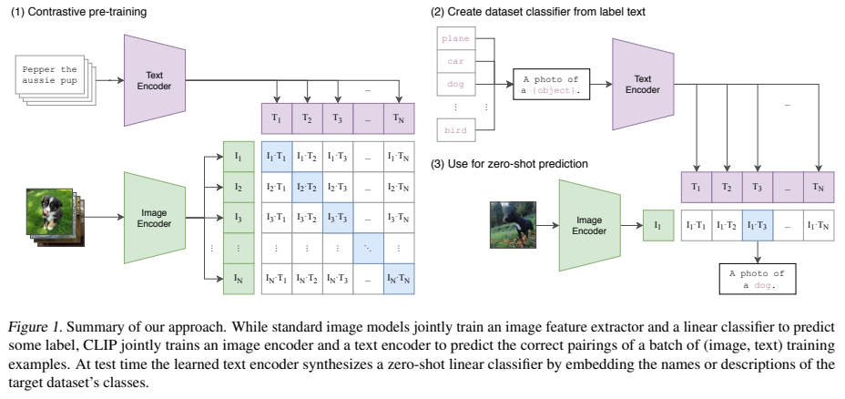

# CLIP 论文笔记

## 论文基本信息
-   **论文标题：** Learning Transferable Visual Models From Natural Language Supervision
-   **作者：** Alec Radford, Jong Wook Kim, Chris Hallacy, Aditya Ramesh, Gabriel Goh, Sandhini Agarwal, Girish Sastry, Amanda Askell, Pamela Mishkin, Jack Clark, Gretchen Krueger, Ilya Sutskever
-   **发表年份与会议/期刊：** 2021, ICML
-   **核心任务：** 视觉表示学习、零样本图像分类 (Zero-Shot Image Classification)

## 1. 研究背景与问题重述 (Background & Problem Statement)
-   **研究背景：** 在这篇论文发表之前，计算机视觉领域的主流模型通常依赖于在大型、人工标注的数据集（如 ImageNet）上进行有监督预训练。尽管这些方法取得了显著成功，但它们也存在一些固有的局限性：(1) 数据集标注成本高昂；(2) 模型的泛化能力受限于预训练数据集中定义的类别，难以直接迁移到新的、未见过的视觉概念；(3) 每个新任务通常需要特定的微调。与此同时，自然语言处理 (NLP) 领域通过利用大规模原始文本数据进行自监督预训练（例如 GPT 系列模型）取得了巨大进展，展现了强大的零样本迁移能力。
-   **核心问题：** 这篇论文明确指出了先前计算机视觉工作中存在的痛点：
    1.  **对大规模、高质量、人工标注数据集的依赖：** 例如 ImageNet，其创建和维护成本高，且类别有限。
    2.  **泛化能力受限：** 传统模型学习到的特征通常与预训练任务的特定类别强相关，难以直接应用于预训练时未见过的类别或任务。
    3.  **迁移成本高：** 对于新的下游任务，通常需要收集特定任务的标注数据并进行模型微调。
    作者声称要解决的核心问题是：**如何利用互联网上更容易获得的大量、自带弱标签的图像-文本对数据，学习一种具有强大泛化能力和零样本迁移能力的视觉模型，从而减少对特定任务标注数据的依赖。**

## 2. 研究目标与核心贡献 (Research Objectives & Core Contributions)
-   **研究目标：**
    1.  提出一种新的视觉预训练方法，该方法能够直接从自然语言描述中学习图像特征。
    2.  构建一个大规模的图像-文本对数据集用于模型预训练。
    3.  实现一个在多种视觉识别任务上具有出色零样本迁移性能的模型。
-   **核心贡献/创新点：**
    1.  **CLIP (Contrastive Language-Image Pre-training) 方法：** 这是论文最核心的创新。作者提出了一种简单而有效的对比学习方法，通过预测一批图像-文本对中哪些图像与哪些文本是匹配的，来共同训练一个图像编码器 (Image Encoder) 和一个文本编码器 (Text Encoder)。
    2.  **大规模图像-文本数据集 (WIT, WebImageText)：** 从互联网收集并构建了一个包含4亿图像-文本对的大规模数据集用于预训练。
    3.  **强大的零样本迁移能力：** CLIP 无需针对特定下游任务进行微调（即零样本学习），仅通过将类别名转换为自然语言描述（例如 "a photo of a {object}"），然后比较图像特征与这些描述特征的相似度，即可在超过30个不同的视觉数据集上取得与完全监督模型相当甚至更好的性能。
    -   **独特性和重要性：** CLIP 的独特性在于其直接利用自然语言作为监督信号，使得模型能够学习到更广泛、更抽象的视觉概念，而不仅仅局限于预定义的一组类别。这使得模型能够以前所未有的方式泛化到新的视觉任务和类别。其重要性体现在它为视觉模型的预训练提供了一种新的范式，显著降低了对昂贵的人工标注数据的依赖，并推动了零样本学习在计算机视觉领域的边界。

## 3. 方法与工作流程 (Methodology & Workflow)
-   **核心思想/方法：**
    -   **核心机制：** 采用了对比学习 (Contrastive Learning) 的框架。目标是学习一个多模态嵌入空间，使得匹配的图像和文本在该空间中的嵌入向量具有较高的余弦相似度，而不匹配的图像和文本则具有较低的余弦相似度。
    -   **关键组成部分：**
        1.  **图像编码器 (Image Encoder)：** 可以是标准的卷积神经网络 (如 ResNet) 或 Vision Transformer (ViT)，用于将输入图像转换为一个固定维度的图像特征向量。
        2.  **文本编码器 (Text Encoder)：** 通常是一个 Transformer 模型，用于将输入文本（如图像的描述或类别名转换的句子）转换为一个固定维度的文本特征向量。
        3.  **对比损失函数 (Contrastive Loss)：** 对于一个包含 $N$ 个 (图像, 文本) 对的批次，模型会计算 $N \times N$ 的相似度矩阵。损失函数的目标是最大化对角线上正确配对的 (图像, 文本) 的相似度，同时最小化非对角线上错误配对的相似度。论文在此处使用了对称的交叉熵损失。
    -   **继承与发展：** 该方法借鉴了先前在自监督学习和对比学习领域的工作，特别是 NLP 中利用大规模文本进行预训练的思想，并将其成功地迁移和应用于视觉与语言的多模态学习。它也受到了早期将图像与文本标签关联的工作的启发，但 CLIP 将其扩展到了更通用的自然语言描述和更大规模的数据。
    -   **关键假设：** (1) 互联网上存在大量的图像及其伴随文本，这些文本（如标题、描述）能够为图像内容提供有效的弱监督信号。(2) 通过对比学习，模型能够学习到图像和文本之间共享的语义概念，从而将视觉特征与自然语言语义对齐。

-   **工作流程：**
    

    **(1) 对比预训练 (Contrastive pre-training):**
    *   **输入：** 一批图像（例如，图片中左侧的 N 张图像，其中一张是 "Pepper the aussie pup" 的照片）和它们对应的文本描述（例如，N 段文本描述，其中一段是 "Pepper the aussie pup"）。
    *   **图像编码：** 每张图像 $I_i$ 通过图像编码器 (Image Encoder) 得到图像特征 $I_i$ (图中表示为 $I_1, I_2, ..., I_N$ 的绿色向量)。
    *   **文本编码：** 每段文本 $T_j$ 通过文本编码器 (Text Encoder) 得到文本特征 $T_j$ (图中表示为 $T_1, T_2, ..., T_N$ 的紫色向量)。
    *   **相似度计算与优化：** 计算所有图像特征和文本特征之间的余弦相似度，形成一个 $N \times N$ 的相似度矩阵（图中中间的表格 $I_i \cdot T_j$）。对角线上的元素（例如 $I_1 \cdot T_1, I_2 \cdot T_2, ..., I_N \cdot T_N$，图中蓝色高亮部分）代表匹配的图像-文本对，它们的相似度应该被最大化。非对角线上的元素代表不匹配的对，它们的相似度应该被最小化。这是通过一个对称的对比损失函数来实现的。

    **(2) 从标签文本创建数据集分类器 (Create dataset classifier from label text) - 用于零样本预测的准备阶段：**
    *   **输入：** 目标下游任务的类别名称列表（例如，图片中的 "plane", "car", "dog", ..., "bird"）。
    *   **提示工程 (Prompt Engineering)：** 将每个类别名称嵌入到一个预定义的文本模板中，形成一个描述性的句子。例如，对于类别 "dog", 生成的提示是 "A photo of a {object}."，即 "A photo of a dog."。
    *   **文本编码：** 使用预训练好的文本编码器 (Text Encoder) 将这些生成的提示语句编码为对应的文本特征向量 ($T_1, T_2, ..., T_N$)。这些文本特征向量可以被视为该分类器的 "权重"。

    **(3) 用于零样本预测 (Use for zero-shot prediction):**
    *   **输入：** 一张待分类的图像（例如，图片右下角的狗的图像）。
    *   **图像编码：** 使用预训练好的图像编码器 (Image Encoder) 将该图像编码为图像特征向量 $I_1$。
    *   **相似度匹配：** 计算该图像特征 $I_1$ 与步骤 (2) 中所有类别的文本特征 ($T_1, T_2, ..., T_N$) 之间的余弦相似度（图中右侧的表格 $I_1 \cdot T_j$）。
    *   **输出：** 选择与图像特征 $I_1$ 具有最高余弦相似度的文本特征所对应的类别作为预测结果。在图片示例中，如果 $I_1 \cdot T_3$ (其中 $T_3$ 对应 "A photo of a dog.") 的值最高（图中蓝色高亮），则预测结果为 "A photo of a dog."。

    **Mermaid 流程图示意 (零样本预测阶段):**
    ```mermaid
    graph TD
        A[输入: 未知图像] --> B(图像编码器 Image Encoder);
        B --> C[图像特征 I_1];
        D[下游任务类别标签: plane, car, dog...];
        D --> E{"提示工程: A photo of a {label}."};
        E --> F[文本提示: A photo of a plane., A photo of a car., A photo of a dog...];
        F --> G(文本编码器 Text Encoder);
        G --> H[文本特征 T_1, T_2, T_3...];
        C -.-> I{计算余弦相似度};
        H -.-> I;
        I --> J[预测结果: 最高相似度对应的类别];
    ```

## 4. 实验评估 (Evaluation)
-   **评估方案：**
    -   **数据集：** 在超过30个现有的计算机视觉数据集上评估了 CLIP 的零样本分类能力，包括 ImageNet、Food101、CIFAR10/100、Oxford-IIIT Pets、Flowers102、FGVC Aircraft 等通用和细粒度分类数据集，以及一些专门任务的数据集如 SST-2 (情感分析，通过渲染文本为图像进行评估) 和 Hateful Memes。此外，本文也在 Flickr30k 和 MSCOCO 等数据集上评估了图像-文本检索性能。
    -   **评估指标：**
        -   对于分类任务：主要是准确率 (Accuracy)。
        -   对于检索任务：召回率 (Recall@K, 例如 R@1, R@5, R@10)。
    -   **关键图表信息：**
        -   论文中的 Figure 4 ("Prompt engineering and ensembling improve zero-shot performance") 显示，通过精心设计提示语（prompt engineering）和集成（ensembling），零样本分类性能可以得到显著提升（平均近5个百分点），这种提升效果类似于将计算量增加四倍。
        -   Table 13 展示了 CLIP 在 Flickr30k 和 MSCOCO 上的文本检索和图像检索结果，表明零样本 CLIP 在某些指标上能够与经过微调的先进模型相媲美，甚至在 Flickr30k 文本检索的 R@1 上优于一些微调模型。
        -   关于 OCR 的结果 (如 SST-2 上的表现) 表明 CLIP 不仅能理解图像内容，还能从图像中提取并理解文本信息，将其转换为有意义的句子级别表示。

-   **实验设置：**
    -   **预训练：** 使用了自己收集的包含4亿图像-文本对的 WIT 数据集进行预训练。图像编码器尝试了 ResNet 系列（如 ResNet-50, ResNet-101, 以及更大的 EfficientNet 风格的变体）和 Vision Transformer (ViT) 系列。文本编码器使用了 Transformer 架构。训练细节包括使用 AdamW 优化器，特定的学习率调度策略和较大的批次大小。
    -   **零样本评估：** 对于零样本分类，作者为每个数据集的类别名称构建了文本提示（如 "A photo of a {label}."），然后使用预训练的 CLIP 模型进行推理，无需任何特定于下游数据集的训练。
    -   **线性探针评估 (Linear Probe)：** 为了与传统的有监督预训练方法进行更公平的比较，本文还在预训练好的 CLIP 图像编码器之上训练了一个线性分类器，并在多个数据集上进行了评估。

-   **主要结果：**
    -   **强大的零样本分类性能：** CLIP 在许多数据集上（包括 ImageNet）的零样本分类性能能够匹敌甚至超越那些在该数据集上经过完全监督训练的 ResNet-50 基线模型。例如，在 ImageNet 上，零样本的 CLIP ResNet-50 达到了与监督训练的 ResNet-50 相当的准确率。
    -   **优越的线性探针性能：** 在线性探针评估中，CLIP 学习到的特征通常也表现出比其他自监督或有监督方法更强的性能，这表明其特征具有很好的可迁移性和线性可分性。
    -   **广泛的适用性：** CLIP 不仅在常见的物体识别任务上表现良好，还在 OCR、动作识别、地理定位等多种类型的任务上展现了潜力。
    -   这些结果有力地证明了从自然语言监督中学习视觉模型的可行性和有效性，以及 CLIP 方法在零样本迁移方面的强大能力。

-   **分析与讨论：**
    -   **优势：**
        -   **数据效率 (对于下游任务)：** 无需下游任务的标注数据即可实现强大的性能。
        -   **泛化能力强：** 能够识别训练时未见过的概念。
        -   **鲁棒性：** 对自然分布的变化表现出比标准 ImageNet 模型更好的鲁棒性。
        -   **计算效率（对于推理）：** 零样本预测过程相对简单高效。
    -   **潜在不足/挑战：**
        -   **对提示工程的敏感性：** 零样本性能可能受到提示语选择的影响。找到最优提示可能需要一些尝试。
        -   **预训练成本高：** 预训练 CLIP 需要大量的计算资源和数据。
        -   **细粒度识别的局限性：** 对于一些需要极其细致区分的任务，或者与常见网络文本描述关联较少的抽象概念，CLIP 的性能可能不如专门训练的模型。
        -   **社会偏见：** 由于模型从大规模网络数据中学习，可能会学到并放大数据中存在的社会偏见 (如性别、种族偏见)。作者在论文的 "Broader Impacts" 部分对此进行了讨论。

## 5. 结论与展望 (Conclusion & Future Work)
-   **主要结论：**
    -   **(Strong conclusions):**
        1.  通过大规模自然语言监督进行视觉预训练是一种非常有效的方法，可以学习到高度可迁移的视觉表示。
        2.  CLIP 模型展现了前所未有的零样本迁移能力，能够在多种视觉识别任务上达到与有监督模型相当甚至更好的性能，而无需针对特定任务进行训练。
        3.  自然语言为视觉学习提供了一个灵活且强大的监督来源。
    -   **(Weaker conclusions / Discussions):**
        1.  这种预训练范式有可能改变未来计算机视觉模型开发的方式，减少对特定任务标注数据集的依赖。
        2.  CLIP 学习到的表示似乎比传统模型更能捕捉图像的抽象语义信息。

-   **局限性：**
    -   作者提及了模型可能从训练数据中学习到社会偏见，这是一个重要的伦理问题。
    -   尽管零样本性能强大，但在某些非常专业或细粒度的任务上，CLIP 可能仍不如经过精心微调的专用模型。
    -   预训练的计算成本非常高昂。
    -   零样本性能对提示词的选择存在一定敏感性。
    -   对于一些抽象的、难以用简单文本描述的视觉任务，CLIP 可能表现不佳。

-   **未来工作：**
    -   作者建议进一步研究和表征 CLIP 这类模型的能力、缺陷和偏见。
    -   探索更多有益的下游应用场景，并警惕潜在的误用。
    -   开发更好的评估基准和方法来衡量这类模型的性能和鲁棒性。
    -   研究如何减轻模型中的偏见。
    -   将类似的思想扩展到其他模态（如视频、音频）或更复杂的任务。

## 6. 个人思考与疑问 (Personal Thoughts & Questions)
-   **我的理解与收获：**
    -   我对 CLIP 的核心思想的理解是，它通过巧妙的对比学习框架，成功地将图像的视觉信息与自然语言的语义信息在一个共享的嵌入空间中对齐。这种对齐使得模型能够理解图像内容，并能通过自然语言指令进行灵活的零样本推理。关键在于利用了网络上丰富的图像-文本对作为“免费”的监督信号。
    -   它对视觉表示学习领域的发展具有里程碑式的意义。它证明了摆脱传统固定类别标签、转向更通用的自然语言监督是可行的，并为构建更通用、适应性更强的人工智能系统开辟了道路。
    -   CLIP 与我已学的深度学习知识紧密相关：
        -   **卷积网络/Vision Transformer：** 作为图像编码器的骨干。
        -   **Transformer：** 作为文本编码器的核心。
        -   **注意力机制：** Transformer 的关键组成部分，也可能用于图像编码器的池化层。
        -   **对比损失函数：** 如 InfoNCE loss 的变体，是自监督学习和度量学习中的重要工具。
        -   **嵌入空间：** 将不同模态的数据映射到同一向量空间进行比较是多模态学习的核心思想。

-   **我的疑问：**
    1.  预训练过程中，CLIP 对图像-文本对的质量（例如，文本是否准确描述图像）有多敏感？噪声数据的影响有多大？
    2.  CLIP 在处理需要复杂推理或组合泛化的视觉任务（例如，识别图像中物体间的关系或计数）时表现如何？这些在论文中似乎没有作为主要评估点。
    3.  除了分类和检索，CLIP 的特征能否有效地应用于更复杂的下游任务，如目标检测、实例分割或图像生成，而无需大量的额外模块或微调？
    4.  提示工程虽然有效，但也引入了人工调优的成分。是否存在更自动或更鲁棒的方法来生成或选择最优提示？

-   **可借鉴之处/批判性思考：**
    -   **可借鉴之处：**
        -   其简洁而强大的对比学习框架是解决多模态对齐问题的有效范例。
        -   利用大规模、弱监督数据的思想对于资源受限或标注困难的领域具有启发意义。
        -   零样本评估的范式非常值得借鉴，它能更好地衡量模型的真实泛化能力。
    -   **可改进或探讨的点：**
        -   如何更有效地处理和过滤训练数据中的噪声和偏见。
        -   如何提高模型在需要精细识别和复杂逻辑推理任务上的性能。
        -   探索将 CLIP 的思想与生成模型更紧密地结合，实现更强大的多模态理解与生成能力。
    -   **潜在应用：**
        -   **多模态搜索引擎：** 用户可以用自然语言描述来搜索图片或视频。
        -   **图像/视频自动标注与描述生成。**
        -   **机器人视觉与交互：** 使机器人能理解自然语言指令并与环境互动。
        -   **内容审核与安全：** 自动识别不当或有害的视觉内容。
        -   **创意辅助工具：** 根据文本描述生成或编辑图像的初步概念。

## 7. 总结摘要 (Summary)
-   CLIP 模型通过在一个包含4亿图像-文本对的巨大数据集上进行对比学习，成功地训练了一个图像编码器和一个文本编码器。其核心思想是将匹配的图像和文本在共享嵌入空间中的表示拉近，不匹配的则推远。这一方法使得 CLIP 具备了前所未有的零样本迁移能力，能够直接在未经训练的下游视觉任务上取得优异表现，仅需将类别名转换为自然语言提示即可。CLIP 的关键成果在于证明了利用大规模自然语言监督学习可迁移视觉模型的可行性和强大潜力，为计算机视觉领域开辟了减少对昂贵人工标注依赖的新路径，并显著推动了零样本学习的发展。

# CLIP 代码阅读与解释

详细的阅读笔记可见代码当中的中文注释。

以下是我的想法：

1. 算法的优点
    - **跨模态理解能力：** CLIP通过在大规模图像-文本对上进行对比学习，使得模型能够理解图像和文本之间的语义关联，从而实现零样本（zero-shot）图像分类、图像检索等任务，无需针对特定任务进行微调。
    - **零样本学习能力：** 模型在训练过程中并未见过具体的下游任务标签，但通过学习图像和文本的联合嵌入空间，能够将新的文本描述（如类别名称）与图像进行匹配，展现出强大的泛化能力。
    - **高效的特征表示：** CLIP学习到的图像和文本嵌入是高维的、语义丰富的向量，这些向量可以作为通用特征表示，应用于多种下游任务，减少了对特定任务特征工程的需求。
    - **鲁棒性：** 由于在大规模多样化数据集上进行训练，CLIP对图像的风格、视角、背景变化以及文本描述的多样性具有较好的鲁棒性。
    - **架构灵活性：** 视觉编码器支持ResNet和Vision Transformer两种架构，文本编码器采用Transformer，这种模块化的设计使得模型可以根据需求选择不同的骨干网络，具有一定的灵活性。

2. 算法的缺点
    - **计算资源需求高：** CLIP的训练需要极其庞大的数据集（4亿图像-文本对）和巨大的计算资源，这使得个人或小型团队难以从头训练CLIP模型。
    - **对训练数据偏差的敏感性：** 尽管训练数据量大，但如果数据集中存在偏差，模型可能会学习到并放大这些偏差，导致在特定群体或特定类型的图像上表现不佳，甚至产生偏见。
    - **细粒度识别能力有限：** 尽管CLIP在概念层面具有强大的理解能力，但在某些需要极高细粒度识别（例如区分非常相似的物种或产品型号）的任务上，其性能可能不如专门针对该任务训练的模型。
    - **无法直接生成内容：** CLIP是一个判别模型，主要用于理解图像和文本之间的关系，但它不具备直接生成图像或文本内容的能力。
    - **对文本描述的依赖：** 零样本能力高度依赖于用户提供的文本描述的质量和准确性。如果文本描述不清晰或不准确，模型的性能会受到影响。

3. 自己的收获
    - **对比学习的强大潜力：** 深入理解了对比学习在跨模态任务中的应用，通过最大化正样本对（图像-文本）的相似度，最小化负样本对的相似度，模型能够学习到有效的联合嵌入空间。
    - **多模态融合的重要性：** 认识到将不同模态（图像和文本）的信息融合到一个统一的表示空间中的重要性，这为解决更复杂的AI任务提供了新的思路。
    - **Transformer架构的普适性：** 再次验证了Transformer架构在不同模态（视觉和文本）任务中的强大适应性和有效性，其自注意力机制能够捕捉长距离依赖关系。
    - **大规模预训练的价值：** 学习到在大规模数据集上进行预训练对于模型泛化能力和零样本能力的重要性，这使得模型能够学习到更通用的知识。
    - **工程实现细节：** 通过阅读代码，了解了CLIP模型在PyTorch中的具体实现细节，包括ResNet和Vision Transformer的修改、注意力池化、LayerNorm的fp16处理、参数初始化以及因果注意力掩码的构建等。这些细节对于理解模型性能和进行后续改进具有指导意义。